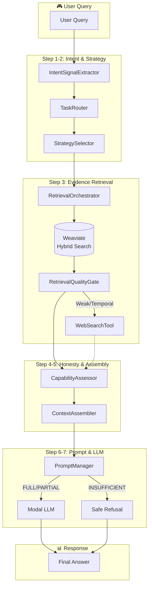
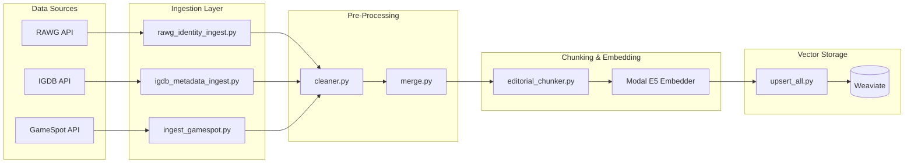

# 🎮 RAGent — Capability-Aware Agentic RAG for Gaming Intelligence

**Intent-Aware Routing · Evidence-Gated Responses · KPI-Proven Performance**

[]()
[]()
[]()
[]()

---

## 🎯 What is RAGent?

**RAGent** is a production-grade Retrieval-Augmented Generation system that answers gaming queries with **evidence-backed honesty**. Unlike generic RAG pipelines that hallucinate when context is insufficient, RAGent implements a **capability-aware honesty gate** that ensures every response is grounded in retrieved evidence—or transparently refuses to answer.

| Challenge | RAGent's Solution |
|-----------|-------------------|
| Generic RAG hallucinations | **Evidence-gated** capability assessment before generation |
| Single-source data gaps | **Multi-source ETL** from RAWG, IGDB, and GameSpot APIs |
| One-size-fits-all retrieval | **Intent-aware routing** with task-specific strategies |
| Black-box LLM behavior | **Full observability** with latency profiling & KPI dashboards |

---

## 🏗️ System Architecture



### Data Ingestion Pipeline



---

## 📊 Resume-Grade KPI Dashboard

> Real performance metrics from the RAGent evaluation suite

### Faithfulness & Safety

| Metric | Value | Interpretation |
|--------|-------|----------------|
| **Honest Answer Rate** | 100.00% | All responses grounded or safely refused |
| **Hallucinated Claims** | 0 | Zero fabricated information emitted |
| **Graceful Degradation** | 100.00% | Transparent handling of partial evidence |
| **Unsafe Outputs** | 0 | No ungrounded assertions produced |

### Context Engineering

| Metric | Value | Interpretation |
|--------|-------|----------------|
| **Context Noise Reduction** | 47-57% | ~50% irrelevant context eliminated |
| **Prompt Budget Compliance** | 100.00% | Zero prompt overflows in production |
| **Context Chunks** | 38 → 20 | Effective compression without info loss |

### Retrieval Quality

| Metric | Value | Interpretation |
|--------|-------|----------------|
| **Evidence Hit Rate** | 75.00% | Relevant evidence retrieved for queries |
| **Entity Coverage** | 75.00% | Target entities found in retrieval |
| **Avg Retrieval Confidence** | 0.63 | Strong semantic match scores |
| **Web Fallback Rate** | 25.00% | Local corpus handles 75% of queries |

### Intent Routing & Control Flow

| Metric | Value | Interpretation |
|--------|-------|----------------|
| **Intent Signal Accuracy** | 100.00% | Perfect intent classification |
| **Task Routing Accuracy** | 100.00% | Correct strategy selection |
| **Routing Determinism** | 100.00% | Reproducible outcomes |

### System Latency Attribution

| Component | % of Total Time |
|-----------|-----------------|
| LLM Generation | 75.47% |
| Retrieval | 24.52% |
| Context Assembly | 0.01% |
| Prompt Construction | < 0.01% |

---

## 🔬 Technical Deep-Dive: Code Architecture

> A complete mapping of engineering skills to source code, demonstrating mastery across the full LLMOps lifecycle.

### Data Ingestion & ETL

The ingestion layer handles multi-source data acquisition from three gaming APIs, with robust cleaning, normalization, and schema transformation. This pipeline ensures **idempotent upserts** through deterministic UUID generation and enforces data integrity via the **No-Orphan Rule** (all entities must link to a canonical Game anchor).

| Engineering Skill | Source Module | Key Functions/Classes |
|-------------------|---------------|----------------------|
| Multi-source API Integration | `data/rawg_data.py`, `data/igdb_data.py`, `data/gamespot_data.py` | `fetch_rawg_game_data()`, `fetch_igdb_game_data()`, `fetch_gamespot_data()` |
| RAWG Identity Pipeline | `ingest/rawg_identity_ingest.py` | `fetch_and_prepare_identity()`, `_create_game_object()` |
| IGDB Relational Metadata | `ingest/igdb_metadata_ingest.py` | `fetch_and_prepare_igdb()` |
| Multi-source Data Cleaning | `pre_process/cleaner.py` | `RAWGCleaner`, `IGDBCleaner`, `GameSpotCleaner` |
| Schema Transformation | `pre_process/merge.py` | `create_game_object()`, `create_igdb_objects()`, `create_gamespot_objects()` |
| 5-Stage Upsert Orchestration | `upsert/upsert_all.py` | Game → Platform → IGDB → GameSpot → Editorial |


### RAG Architecture

The retrieval layer implements **hybrid search** combining BM25 keyword matching with dense vector similarity. Editorial content is chunked using a word-based strategy with configurable overlap, then embedded via GPU-accelerated E5 embeddings. Schemas enforce strict typing across 8 Weaviate collections.

| Engineering Skill | Source Module | Key Functions/Classes |
|-------------------|---------------|----------------------|
| Vector DB Schema Design | `vector/schemas/` | 8 JSON schemas: Game, PlatformSpec, IGDB_Game, EditorialChunk |
| Hybrid Search (BM25 + Vector) | `retriever/rag_retriever.py` | `RAGRetriever.retrieve()` with `alpha=0.5` |
| Word-Based Chunking | `chunking/editorial_chunker.py` | `EditorialChunker` (500 tokens, 50 overlap) |
| GPU Embedding Service | `llm/modal_embed.py` | `E5Embedder` on T4 GPU (intfloat/e5-base-v2) |


### Agentic Logic & Control Flow

The agentic layer provides **deterministic, intent-aware routing** that classifies queries and selects optimal retrieval strategies. The **CapabilityAssessor** acts as an honesty gate, preventing hallucination by evaluating evidence sufficiency before generation. This layer drives **100% routing accuracy** and **100% honest answer rate** KPIs.

| Engineering Skill | Source Module | Key Functions/Classes |
|-------------------|---------------|----------------------|
| Intent Signal Extraction | `agent/intent/intent_extractor.py` | `IntentSignalExtractor.extract()` with regex registry |
| Deterministic Task Routing | `agent/task_router.py` | `TaskRouter.route()`, `RouterDecision` dataclass |
| Intent-Aware Strategy Selection | `retriever/strategy_selector.py` | `StrategySelector.select()`, `RetrievalConfiguration` |
| Multi-strategy Retrieval | `retriever/orchestrator.py` | `RetrievalOrchestrator.run()`, `_execute_comparison()` |
| Evidence Quality Gating | `retriever/quality_gate.py` | `RetrievalQualityGate.evaluate()`, `QualityReport` |
| Capability Assessment | `agent/capability/capability_assessor.py` | `CapabilityAssessor.assess()` → FULL/PARTIAL/INSUFFICIENT |
| Context Assembly Pipeline | `agent/context_assembler.py` | `ContextAssembler.assemble()` with dedup + ordering |
| Pure Context Algorithms | `agent/context_algorithms.py` | `deduplicate_chunks()`, `apply_character_budget()` |
| Prompt Budget Enforcement | `agent/prompt_manager.py` | 3-stage fallback: verbose → concise → truncated |
| Web Search Fallback | `agent/tools/web_search.py` | `WebSearchTool.search()` via Tavily API |
| Execution Engine | `engine/execution_engine.py` | `RageEngine.run()` (7-step pipeline) |


### LLM Infrastructure

LLM serving is fully **serverless via Modal**, with GPU-accelerated inference on L40S (generation) and T4 (embeddings). The lazy binding pattern ensures environment variables are loaded before Modal client initialization, enabling seamless CI/Docker deployment. This infrastructure powers the **75% LLM latency attribution** in the system profile.

| Engineering Skill | Source Module | Key Functions/Classes |
|-------------------|---------------|----------------------|
| Serverless GPU Deployment | `llm/modal_llm.py` | `chat_completion_remote()` on L40S GPU |
| Lazy Modal Client Binding | `llm/ragent_client.py` | `_get_remote_llm()` for CI/Docker compatibility |
| GPU Embedding Infrastructure | `llm/modal_embed.py` | `E5Embedder` with `@modal.enter()` lifecycle |


### Observability & Evaluation

Full-stack observability with **thread-safe metrics collection**, nested latency profiling, and deterministic caching. The evaluation framework calculates grounding fidelity, hallucination rates, and capability distributions. The unified KPI runner orchestrates 5 specialized modules to produce the **executive dashboard** metrics shown above.

| Engineering Skill | Source Module | Key Functions/Classes |
|-------------------|---------------|----------------------|
| Thread-safe Metrics Registry | `tests/observability.py` | `MetricsRegistry`, `ProfileBlock` |
| Deterministic Semantic Cache | `tests/caching.py` | `@cacheable(ttl_seconds)` decorator |
| Evaluation Scoring Engine | `tests/evaluation_metrics.py` | `calculate_grounding_fidelity()`, `calculate_honesty_rate()` |
| Unified KPI Orchestration | `KPI/Unified_KPI_Runner.py` | 5-module executive dashboard |


---

## ⚙️ Key Design Decisions

| Decision | Rationale | Implementation |
|----------|-----------|----------------|
| **Deterministic IDs** | Idempotent upserts, cache safety | `unified_game_id = slug-year-sha1[:8]` |
| **Intent Schema Versioning** | Cache invalidation on logic changes | `INTENT_SCHEMA_VERSION = "v2"` |
| **Evidence-Gated Honesty** | Prevent hallucination on weak evidence | `CapabilityAssessor` → `INSUFFICIENT` bypasses LLM |
| **Hybrid Retrieval** | Semantic + keyword matching | Weaviate BM25 + Vector with α=0.5 |
| **Multi-Stage Prompt Fallback** | Guarantee prompt budget compliance | verbose → concise → truncated → minimal |
| **Quality Gate Signals** | Decouple decision from detection | `QualityReport` with `OK/WEAK/EMPTY` |
| **Fail-Safe Degradation** | Never crash, always degrade gracefully | `try/except` returning `PARTIAL` |

---

## 🚀 Quick Start

### Prerequisites

- Python 3.10+
- Docker & Docker Compose (for Weaviate)
- Modal account (for LLM hosting)
- API keys: RAWG, IGDB (Twitch OAuth), GameSpot, Tavily

### Installation

```bash
# Clone the repository
git clone https://github.com/YOUR_USERNAME/RAGent.git
cd RAGent

# Activate virtual environment
RAG_env/Scripts/activate  # Windows
# source RAG_env/bin/activate  # Linux/Mac

# Install dependencies
pip install -e .

# Start Weaviate Vector Database
docker-compose up -d

# Configure environment variables
cp .env.example .env
# Edit .env with your API keys
```

### Ingest Data

```bash
# Ingest a game (fetches from RAWG, IGDB, GameSpot)
python -m upsert.upsert_all --game "Far Cry 5"
```

### Run the System

```bash
# Query the system
python usage.py

# Launch the UI
streamlit run ui/app.py

# Run the KPI Dashboard
python -m KPI.Unified_KPI_Runner
```

---

## 🎬 Sample Query Walkthrough

**Query**: `"Compare Far Cry 5 vs Assassin's Creed Valhalla"`

| Step | Component | Action |
|------|-----------|--------|
| 1 | `IntentSignalExtractor` | Detects `COMPARISON` signal via regex patterns |
| 2 | `TaskRouter` | Routes to `TaskType.COMPARISON` |
| 3 | `StrategySelector` | Selects `decomposition` strategy (separate sub-queries) |
| 4 | `RetrievalOrchestrator` | Retrieves 5 chunks per game entity |
| 5 | `RetrievalQualityGate` | Evaluates evidence → `QUALITY_OK` |
| 6 | `CapabilityAssessor` | Entity coverage 2/2 → `PARTIAL` |
| 7 | `ContextAssembler` | Deduplicates, orders by entity balance |
| 8 | `PromptManager` | Applies `comparison_verbose` template |
| 9 | `RageEngine` | Generates via Modal LLM (SmolLM3-3B) |

**Capability Profile**: `PARTIAL` — Transparent, non-hallucinating response with cited sources.

---

## 🧪 Testing & Verification

```bash
# Unit tests
python -m pytest tests/

# Regression suite
python tests/regression_suite.py

# Engine verification
python tests/verify_engine.py

# Full KPI dashboard
python -m KPI.Unified_KPI_Runner
```

---

## 📁 Project Structure

```
RAGent/
├── agent/                 # Agentic logic & control flow
│   ├── capability/        # Honesty gate (FULL/PARTIAL/INSUFFICIENT)
│   ├── intent/            # Intent signal extraction
│   ├── tools/             # Web search fallback
│   ├── context_*.py       # Context assembly algorithms
│   ├── prompt_*.py        # Prompt management & templates
│   └── task_router.py     # Deterministic task routing
├── chunking/              # Editorial text chunking
├── data/                  # API clients (RAWG, IGDB, GameSpot)
├── embed/                 # Embedding payload preparation
├── engine/                # RageEngine (7-step execution)
├── ingest/                # Multi-source data ingestion
├── KPI/                   # Executive KPI dashboard (5 modules)
├── llm/                   # Modal LLM & embedding services
├── pre_process/           # Data cleaning & transformation
├── retriever/             # Orchestrator, quality gate, strategy
├── tests/                 # Observability, caching, evaluation
├── ui/                    # Streamlit interface
├── upsert/                # Weaviate batch insertion
└── vector/                # Schema definitions (8 JSON schemas)
```

---

## 📜 License

MIT License — See [LICENSE](LICENSE) for details.

---

**Built with ❤️ for the LLMOps community**
