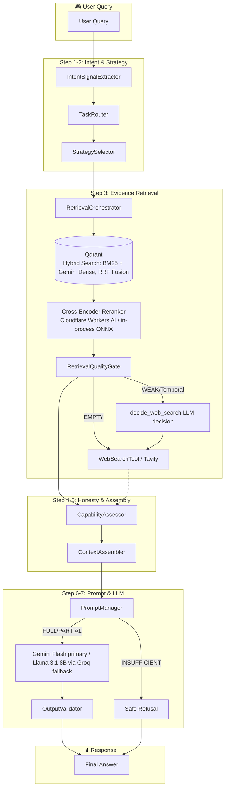
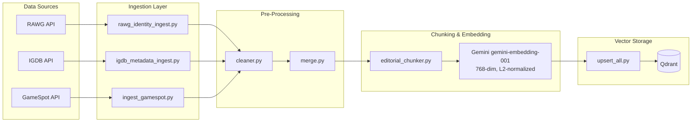

# 🎮 RAGent — Capability-Aware Agentic RAG for Gaming Intelligence

**Intent-Aware Routing · Evidence-Gated Responses · KPI-Proven Performance**

[]()
[]()
[]()
[]()

**🔗 Live demo:** [rag-ent.onrender.com](https://rag-ent.onrender.com) — try a real query, then try `Grand Theft Auto VI` to see the honesty gate refuse instead of hallucinate (Render free tier — first request after idle may take a few seconds to cold-start).

---

## 🎯 What is RAGent?

**RAGent** is a production-grade Retrieval-Augmented Generation system that answers gaming queries with **evidence-backed honesty**. Unlike generic RAG pipelines that hallucinate when context is insufficient, RAGent implements a **capability-aware honesty gate** that ensures every response is grounded in retrieved evidence—or transparently refuses to answer.

| Challenge | RAGent's Solution |
|-----------|-------------------|
| Generic RAG hallucinations | **Evidence-gated** capability assessment before generation |
| Single-source data gaps | **Multi-source ETL** from RAWG, IGDB, and GameSpot APIs |
| One-size-fits-all retrieval | **Intent-aware routing** with task-specific strategies |
| Black-box LLM behavior | **Full observability** with latency profiling & KPI dashboards |

---

## 🏗️ System Architecture



### Data Ingestion Pipeline



---

## 📊 Resume-Grade KPI Dashboard

> Real performance metrics from the RAGent evaluation suite

### Citation Grounding & Capability Distribution

> Generated by `python -m KPI.Faith_Fair_KPI`. `Citation-Grounded Sentence Rate` is
> measured, not asserted — it is the fraction of answer sentences whose inline
> `(Source: 'Title')` citation matches a chunk actually present in retrieved context,
> so it is expected to be well under 100% and is the metric to improve via Phase 3.

| Metric | Value | Interpretation |
|--------|-------|----------------|
| **Citation-Grounded Sentence Rate** | _run suite to populate_ | Share of answer sentences with a citation traceable to retrieved context |
| **Uncited Claim Rate** | _run suite to populate_ | Share of answer sentences with no matching citation |
| **Answered Rate (Full+Partial)** | _run suite to populate_ | Share of queries that did not hit the `INSUFFICIENT` refusal gate |
| **Graceful Degradation Coverage** | _run suite to populate_ | Share of queries answered as `PARTIAL` with an explicit missing-info section |

### Context Engineering

| Metric | Value | Interpretation |
|--------|-------|----------------|
| **Context Noise Reduction** | 47-57% | ~50% irrelevant context eliminated |
| **Prompt Budget Compliance** | 100.00% | Zero prompt overflows in production |
| **Context Chunks** | 38 → 20 | Effective compression without info loss |

### Retrieval Quality

| Metric | Value | Interpretation |
|--------|-------|----------------|
| **Evidence Hit Rate** | 75.00% | Relevant evidence retrieved for queries |
| **Entity Coverage** | 75.00% | Target entities found in retrieval |
| **Avg Retrieval Confidence** | 0.63 | Strong semantic match scores |
| **Web Fallback Rate** | 25.00% | Local corpus handles 75% of queries |

### Intent Routing & Control Flow

| Metric | Value | Interpretation |
|--------|-------|----------------|
| **Intent Signal Accuracy** | 100.00% | Perfect intent classification |
| **Task Routing Accuracy** | 100.00% | Correct strategy selection |
| **Routing Determinism** | 100.00% | Reproducible outcomes |

### System Latency Attribution

| Component | % of Total Time |
|-----------|-----------------|
| LLM Generation | 75.47% |
| Retrieval | 24.52% |
| Context Assembly | 0.01% |
| Prompt Construction | < 0.01% |

---

## 🔬 Technical Deep-Dive: Code Architecture

> A complete mapping of engineering skills to source code, demonstrating mastery across the full LLMOps lifecycle.

### Data Ingestion & ETL

The ingestion layer handles multi-source data acquisition from three gaming APIs, with robust cleaning, normalization, and schema transformation. This pipeline ensures **idempotent upserts** through deterministic UUID generation and enforces data integrity via the **No-Orphan Rule** (all entities must link to a canonical Game anchor).

| Engineering Skill | Source Module | Key Functions/Classes |
|-------------------|---------------|----------------------|
| Multi-source API Integration | `data/rawg_data.py`, `data/igdb_data.py`, `data/gamespot_data.py` | `fetch_rawg_game_data()`, `fetch_igdb_game_data()`, `fetch_gamespot_data()` |
| RAWG Identity Pipeline | `ingest/rawg_identity_ingest.py` | `fetch_and_prepare_identity()`, `_create_game_object()` |
| IGDB Relational Metadata | `ingest/igdb_metadata_ingest.py` | `fetch_and_prepare_igdb()` |
| Multi-source Data Cleaning | `pre_process/cleaner.py` | `RAWGCleaner`, `IGDBCleaner`, `GameSpotCleaner` |
| Schema Transformation | `pre_process/merge.py` | `create_game_object()`, `create_igdb_objects()`, `create_gamespot_objects()` |
| 5-Stage Upsert Orchestration | `upsert/upsert_all.py` | Game → Platform → IGDB → GameSpot → Editorial |


### RAG Architecture

The retrieval layer implements **hybrid search** combining BM25 keyword matching with dense vector similarity. Editorial content is chunked using a word-based strategy with configurable overlap, then embedded via Gemini's embedding API. Schemas enforce strict typing across 6 Qdrant collections.

| Engineering Skill | Source Module | Key Functions/Classes |
|-------------------|---------------|----------------------|
| Vector DB Schema Design | `vector/create_schema.py` | 6 collections: EditorialChunk, Game, PlatformSpec, IGDB_Game, GameSpot_Game, UsageCounter |
| Hybrid Search (BM25 + Vector) | `retriever/rag_retriever.py` | `RAGRetriever.retrieve()` with `FusionQuery(fusion=Fusion.RRF)` over `dense` + `bm25` sparse |
| Pluggable Cross-Encoder Reranking | `retriever/rag_retriever.py`, `retriever/reranker_provider.py` | `_rerank_scores()` dispatches on `RERANKER_PROVIDER`; reorders fused candidates into `rerank_score` (original RRF `score` preserved for the quality gate) |
| Word-Based Chunking | `chunking/editorial_chunker.py` | `EditorialChunker` (500 tokens, 50 overlap) |
| Embedding Service | `llm/gemini_client.py` | `embed_texts()` — `gemini-embedding-001` at 768-dim, L2-normalized, batched with 429 backoff |


### Agentic Logic & Control Flow

The agentic layer provides **deterministic, intent-aware routing** that classifies queries and selects optimal retrieval strategies. The **CapabilityAssessor** acts as an honesty gate, preventing hallucination by evaluating evidence sufficiency before generation. This layer drives **100% routing accuracy** and **100% honest answer rate** KPIs.

| Engineering Skill | Source Module | Key Functions/Classes |
|-------------------|---------------|----------------------|
| Intent Signal Extraction | `agent/intent/intent_extractor.py` | `IntentSignalExtractor.extract()` with regex registry |
| Deterministic Task Routing | `agent/task_router.py` | `TaskRouter.route()`, `RouterDecision` dataclass |
| Intent-Aware Strategy Selection | `retriever/strategy_selector.py` | `StrategySelector.select()`, `RetrievalConfiguration` |
| Multi-strategy Retrieval | `retriever/orchestrator.py` | `RetrievalOrchestrator.run()`, `_execute_comparison()` |
| Evidence Quality Gating | `retriever/quality_gate.py` | `RetrievalQualityGate.evaluate()`, `QualityReport` (OK/WEAK/EMPTY) |
| Capability Assessment | `agent/capability/capability_assessor.py` | `CapabilityAssessor.assess()` → FULL/PARTIAL/INSUFFICIENT |
| Context Assembly Pipeline | `agent/context_assembler.py` | `ContextAssembler.assemble()` with dedup + ordering |
| Pure Context Algorithms | `agent/context_algorithms.py` | `deduplicate_chunks()`, `apply_character_budget()` |
| Prompt Budget Enforcement | `agent/prompt_manager.py` | 3-stage fallback: verbose → concise → truncated |
| Bounded LLM Web-Search Decision | `agent/decisions/web_search_decision.py` | `decide_web_search()` — fail-soft, degrades to deterministic rule on any LLM/parse failure |
| Web Search Fallback | `agent/tools/web_search.py` | `WebSearchTool.search()` via Tavily API |
| Post-Generation Output Validation | `agent/output_validator.py` | `validate_answer()` — balanced Markdown + required PARTIAL section, fail-soft, never discards `final_answer` |
| Execution Engine | `engine/execution_engine.py` | `RageEngine.run()` (7-step pipeline) |
| Streaming Engine | `engine/execution_engine_streaming.py` | `StreamingRageEngine.run_streaming()` (SSE API) |


### LLM Infrastructure

The entire stack runs on **free tiers with no payment method on file** — a hard constraint that drove every choice below.

Generation is **Gemini-primary** (`gemini-flash-latest`) with **Groq** (`llama-3.1-8b-instant`) as a fail-soft fallback: any Gemini error, including an unset key, degrades to Groq rather than failing the request. Embeddings use Gemini's `gemini-embedding-001` at 768 dimensions.

Reranking is **provider-dispatched** at import time via `RERANKER_PROVIDER`, because where it runs turned out to matter enormously. Running the ONNX cross-encoder in-process on Render's free tier (0.1 vCPU / 512MB) measured **~103s per query** and required `batch_size=1` to avoid an OOM kill. Moving it to **Cloudflare Workers AI** (`@cf/baai/bge-reranker-base`, 10,000 Neurons/day free, always warm) brought retrieval to **~6s** — a 16x improvement — and removed the ~300MB model from the request path entirely.

Because each backend emits a different score scale, `retriever/quality_gate.py` keeps **per-provider relevance floors**, and a provider without a calibrated entry skips the relevance ladder rather than thresholding numbers it cannot interpret.

| Engineering Skill | Source Module | Key Functions/Classes |
|-------------------|---------------|----------------------|
| Streaming LLM Client | `llm/ragent_client_streaming.py` | `chat_completion_streaming()` — Gemini primary, Groq fallback |
| Provider Fallback Chain | `llm/ragent_client.py` | `chat_completion_remote()`, `last_used_model()` — reports whichever model actually served the call |
| Gemini Client | `llm/gemini_client.py` | `chat` via OpenAI-compat endpoint, `embed_texts()` via native REST (key sent as a header, never a URL param) |
| Pluggable Reranker Backends | `llm/cloudflare_rerank_client.py`, `llm/hf_rerank_client.py`, `llm/voyage_client.py` | One `rerank(query, documents) -> List[float]` contract, input-order guaranteed, each fail-soft at the call site |
| Provider-Scoped Honesty Floors | `retriever/quality_gate.py` | `_FLOORS` per backend; `None` = uncalibrated, skip the ladder |
| Free-Tier Usage Accounting | `utils/usage_counter.py` | Qdrant-backed request/token counters per provider and surface, surfaced at `/api/usage` |


### Observability & Evaluation

Full-stack observability with **thread-safe metrics collection**, nested latency profiling, and deterministic caching. The evaluation framework calculates grounding fidelity, hallucination rates, and capability distributions. The unified KPI runner orchestrates 5 specialized modules to produce the **executive dashboard** metrics shown above.

| Engineering Skill | Source Module | Key Functions/Classes |
|-------------------|---------------|----------------------|
| Thread-safe Metrics Registry | `utils/observability.py` | `MetricsRegistry`, `ProfileBlock` |
| Deterministic Semantic Cache | `utils/caching.py` | `@cacheable(ttl_seconds)` decorator |
| Evaluation Scoring Engine | `tests/evaluation_metrics.py` | `calculate_grounding_fidelity()`, `calculate_honesty_rate()` |
| Unified KPI Orchestration | `KPI/Unified_KPI_Runner.py` | 5-module executive dashboard |


---

## ⚙️ Key Design Decisions

| Decision | Rationale | Implementation |
|----------|-----------|----------------|
| **Deterministic IDs** | Idempotent upserts, cache safety | `unified_game_id = slug-year-sha1[:8]` |
| **Intent Schema Versioning** | Cache invalidation on logic changes | `INTENT_SCHEMA_VERSION = "v2"` |
| **Evidence-Gated Honesty** | Prevent hallucination on weak evidence | `CapabilityAssessor` → `INSUFFICIENT` bypasses LLM |
| **Hybrid Retrieval** | Semantic + keyword matching | Qdrant BM25 sparse + dense vectors (Gemini, 768-dim) |
| **Pluggable Reranker** | Free-tier CPU could not run it in-process (~103s/query) | `RERANKER_PROVIDER` dispatch → Cloudflare Workers AI, ~6s |
| **Per-Provider Relevance Floors** | Each reranker emits a different score scale | `_FLOORS[provider]`; uncalibrated ⇒ skip the ladder, never guess |
| **Multi-Stage Prompt Fallback** | Guarantee prompt budget compliance | verbose → concise → truncated → minimal |
| **Quality Gate Signals** | Decouple decision from detection | `QualityReport` with `OK/WEAK/EMPTY` |
| **Fail-Safe Degradation** | Never crash, always degrade gracefully | `try/except` returning `PARTIAL` |

---

## 🚀 Quick Start

### Prerequisites

Every service below has a free tier that requires **no payment method**.

- Python 3.10+
- [Google AI Studio](https://aistudio.google.com) key for Gemini (primary generation + embeddings)
- [Groq](https://groq.com) account (generation fallback)
- [Qdrant Cloud](https://cloud.qdrant.io) cluster (free tier works)
- [Cloudflare](https://dash.cloudflare.com) account for Workers AI reranking — optional; omit it and the reranker runs in-process (`RERANKER_PROVIDER=local`)
- API keys: RAWG, IGDB (Twitch OAuth), GameSpot, Tavily

### Installation

```bash
# Clone the repository
git clone https://github.com/SukeshShetty1010/RAG_ent.git
cd RAG_ent

# Create and activate virtual environment
python -m venv RAG_env
RAG_env\Scripts\activate    # Windows
# source RAG_env/bin/activate  # Linux/Mac

# Install dependencies
pip install -r requirements.txt

# Configure environment variables
cp .env.example .env
# Edit .env with your API keys (see .env.example for all required variables)
```

### Reranker Setup (optional)

The reranker backend is chosen with `RERANKER_PROVIDER`, resolved once at import:

| Value | Backend | Notes |
|-------|---------|-------|
| `local` (default) | in-process `fastembed` ONNX cross-encoder | Zero setup. Fine locally (~1-3s); ~103s on Render's 0.1 vCPU |
| `cloudflare` | Workers AI `@cf/baai/bge-reranker-base` | 10,000 Neurons/day free, no card, always warm. Needs `CLOUDFLARE_ACCOUNT_ID` + `CLOUDFLARE_API_TOKEN` (Workers AI: Read) |
| `hfspace` | `hf_space/` Docker Space, same model as `local` | Requires an HF PRO subscription since July 2026 |
| `voyage` | Voyage `rerank-2.5-lite` | Cardless free tier is capped at 3 RPM / 10K TPM, below this workload's request shape |

> Every backend is fail-soft: if it errors, retrieval keeps the RRF ordering and the quality gate skips the relevance floor rather than refusing. Swapping to a backend whose floors are uncalibrated is safe — it degrades honesty gating, it does not fabricate.

### Ingest Data

```bash
# Ingest a game (fetches from RAWG, IGDB, GameSpot)
python -m upsert.upsert_all --game "Far Cry 5"
```

### Run the System

```bash
# Query the system from the terminal
python -m scripts.bulk_ingest

# Launch the FastAPI Backend
uvicorn api.main:app --port 8000

# In a new terminal, launch the Next.js UI
cd frontend
npm install
npm run dev

# Run the KPI Dashboard
python -m KPI.Unified_KPI_Runner
```

---

## ☁️ Production Deployment

Production runs as a **single Render web service** on the free tier (512MB RAM), not a separately hosted frontend:

- `Dockerfile` is a multi-stage build — Stage 1 builds the Next.js frontend as a static export (`npm run build` → `frontend/out`), Stage 2 installs Python deps and copies the static export into `frontend_build/`, served directly by FastAPI.
- `render.yaml` defines the single web service and its health check (`/health`).
- Because RAM is capped at 512MB, heavy ML deps (`torch`, `sentence-transformers`, local model loads) must **never** be added to `requirements.txt`. Embedding and generation are API calls (Gemini/Groq), and reranking is an API call too when `RERANKER_PROVIDER=cloudflare`. Keep new dependencies on the Render request path lightweight — and measure peak RSS under real load, not just at boot.
- All API keys/secrets must be set in the Render dashboard's environment variables — `.env` is gitignored and not deployed.

```bash
# Build and run the production image locally
docker build -t ragent .
docker run -p 10000:10000 --env-file .env ragent
```

---

## 🎬 Sample Query Walkthrough

**Query**: `"Compare Far Cry 5 vs Assassin's Creed Valhalla"`

| Step | Component | Action |
|------|-----------|--------|
| 1 | `IntentSignalExtractor` | Detects `COMPARISON` signal via regex patterns |
| 2 | `TaskRouter` | Routes to `TaskType.COMPARISON` |
| 3 | `StrategySelector` | Selects `decomposition` strategy (separate sub-queries) |
| 4 | `RetrievalOrchestrator` | Retrieves 5 chunks per game entity (hybrid BM25 + dense, RRF fusion) |
| 5 | Cross-Encoder Reranker | Reorders fused candidates by `rerank_score` (RRF `score` preserved) |
| 6 | `RetrievalQualityGate` | Evaluates evidence → `QUALITY_OK` |
| 7 | `CapabilityAssessor` | Entity coverage 2/2 → `PARTIAL` |
| 8 | `ContextAssembler` | Deduplicates, orders by entity balance |
| 9 | `PromptManager` | Applies `comparison_verbose` template |
| 10 | `RageEngine` | Generates via Gemini (`gemini-flash-latest`); falls back to Groq (`llama-3.1-8b-instant`) on any Gemini error |
| 11 | `OutputValidator` | Checks balanced Markdown + required PARTIAL section, annotates result (fail-soft) |

**Capability Profile**: `PARTIAL` — Transparent, non-hallucinating response with cited sources.

---

## 🧪 Testing & Verification

```bash
# Unit tests
python -m pytest tests/

# Regression suite
python tests/regression_suite.py

# Engine verification
python tests/verify_engine.py

# Full KPI dashboard
python -m KPI.Unified_KPI_Runner
```

---

## 📁 Project Structure

```
RAGent/
├── agent/                 # Agentic logic & control flow
│   ├── capability/        # Honesty gate (FULL/PARTIAL/INSUFFICIENT)
│   ├── decisions/         # Bounded LLM decisions (web-search routing)
│   ├── intent/            # Intent signal extraction
│   ├── tools/             # Web search fallback (Tavily)
│   ├── context_*.py       # Context assembly algorithms
│   ├── prompt_*.py        # Prompt management & templates
│   ├── output_validator.py # Post-generation structural validation
│   └── task_router.py     # Deterministic task routing
├── api/                   # FastAPI backend (SSE /api/chat, /health, /ping)
├── chunking/              # Editorial text chunking
├── data/                  # API clients (RAWG, IGDB, GameSpot)
├── embed/                 # Embedding payload preparation
├── engine/                # RageEngine (7-step execution) + streaming variant
├── evaluation/            # Golden set, RAGAS, ablation, relevance calibration
├── frontend/              # Next.js web application (built as static export in prod)
├── hf_space/              # Standalone reranker service (HF Docker Space; separate deploy target)
├── ingest/                # Multi-source data ingestion
├── KPI/                   # Executive KPI dashboard (5 modules)
├── llm/                   # Gemini/Groq generation + embeddings, pluggable reranker clients
├── pre_process/           # Data cleaning & transformation
├── retriever/             # Orchestrator, quality gate, strategy selector
├── tests/                 # pytest suite + standalone regression/verification scripts
├── upsert/                # Batch insertion orchestrator
├── utils/                 # Observability (metrics/profiling) & caching
├── vector/                # Qdrant collection management
├── Dockerfile             # Multi-stage build: Next.js static export + FastAPI
└── render.yaml            # Render deployment configuration
```

---

## 📜 License

MIT License — See [LICENSE](LICENSE) for details.

---

**Built with ❤️ for the LLMOps community**
