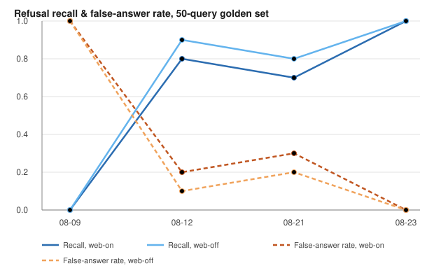
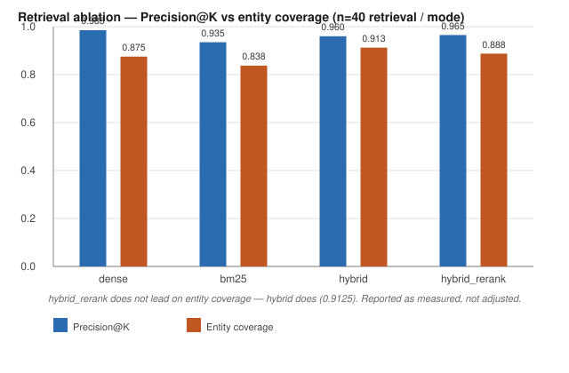
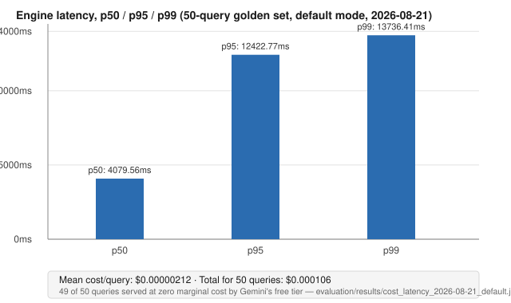
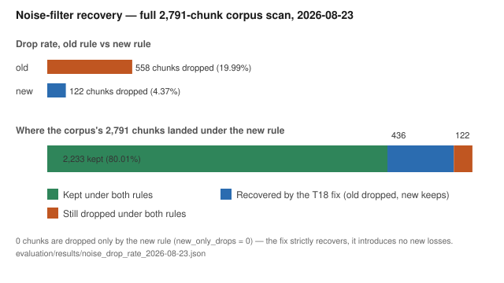
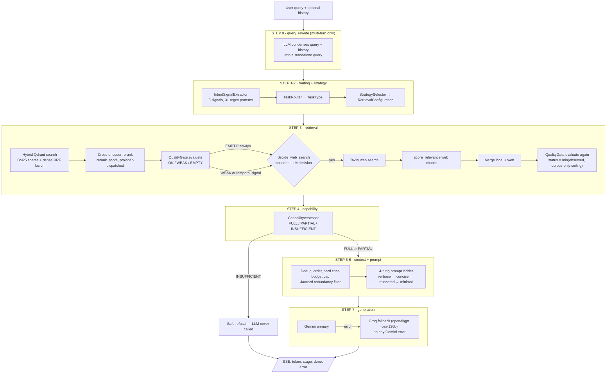
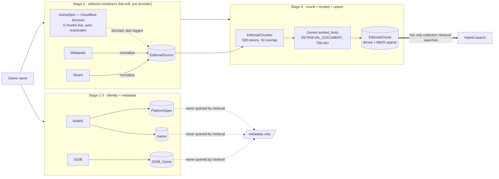
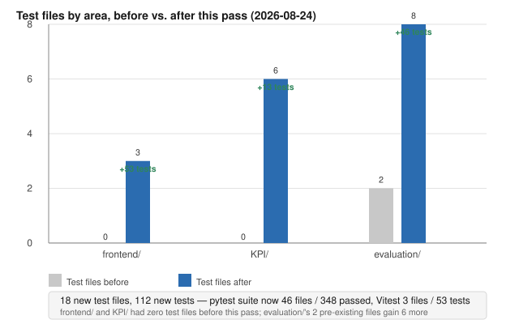

# RAGent — Capability-Aware Agentic RAG That Refuses to Guess

**The architecture — honesty gate, hybrid retrieval, entity disambiguation — is domain-agnostic by design. The implementation is gaming: built, ingested, and measured end-to-end on a 100-game / 2,791-chunk corpus and a 50-query golden set. No other domain has been tried.**

A retrieval-augmented gaming Q&A system built around one constraint: **it is not allowed to guess.** Every response either cites retrieved evidence strong enough to earn it, or refuses and says why. On a 50-query golden set (2026-08-23), that refusal behavior scores **precision 1.0, recall 1.0, false-answer rate 0.0** — with the web fallback on *and* off.

[](https://github.com/SukeshShetty1010/RAGent/actions/workflows/test.yml)
[]()
[]()
[]()
[](LICENSE)

**Live demo:** [rag-ent.onrender.com](https://rag-ent.onrender.com) — ask something real, then ask about `Grand Theft Auto VI` and watch it refuse instead of invent a release date. Render's free tier spins down when idle, so the first request after a quiet period can take a few seconds to cold-start.

---

## The 30-second version

Generic RAG pipelines answer every question the retriever hands them, whether or not the evidence actually supports an answer. That produces confident, fluent, wrong output — the failure mode that makes RAG systems untrustworthy for anything that matters.

RAGent's answer is a **capability-aware honesty gate**: a cross-encoder reranker scores every retrieved chunk against the query, an entity index confirms the chunks are actually about the thing being asked, and a `CapabilityAssessor` converts that evidence into one of three honest states — `FULL`, `PARTIAL`, or `INSUFFICIENT` — before the LLM is ever called. `INSUFFICIENT` never reaches the LLM. There is no path from "the retriever found nothing relevant" to a generated answer.

That gate used to not exist in any effective form — a corpus-only run of the 50-query golden set on 2026-08-09 measured **recall 0.0, false-answer rate 1.0**: every unanswerable query got a confident, wrong answer. The trajectory below is that gate being built, broken twice, and fixed for real:

<p align="center"></p>

<sub>Source: `evaluation/results/refusal_2026-08-{09,12,21,23}_{default,corpusonly}.json` · regenerate with `python -m evaluation.run_eval && python -m evaluation.refusal_metrics --runs <path>`</sub>

**What is the pattern, and what is this build.** The architecture is not gaming-specific; the implementation is. Split explicitly so no one has to guess which is which:

| Domain-agnostic (the pattern) | Gaming-specific (this build) |
|---|---|
| RRF hybrid fusion — BM25 sparse + dense vectors — with a provider-dispatched cross-encoder rerank layered on top | The five ingestion providers: RAWG and IGDB for identity/metadata, GameSpot, Wikipedia, and Steam for editorial content (`ingest/editorial_providers.py:45-49`) |
| `FULL` / `PARTIAL` / `INSUFFICIENT` capability assessment. `agent/capability/capability_assessor.py` contains zero references to games or to any ingestion provider | The 7 Qdrant collections and their payload shapes (`vector/create_schema.py:65-104`) |
| Token-tuple entity grounding — exact tuple containment, not substring matching (`retriever/corpus_index.py:16-19`) | The corpus: 100 games, 2,791 chunks |
| Provider-scoped calibrated relevance floors, and the source-scoped ceiling clamp that stops web evidence from promoting a weak corpus verdict | The 50-query golden set (`evaluation/data/golden_set.jsonl`): 20 factual, 10 comparison, 10 listicle, 10 unanswerable |
| The noise filter's *structure* — a distinct-keyword density threshold, a regex temporal-signal set | The noise filter's *word lists* (`retriever/quality_gate.py:112-133`): `sale`, `bundle`, `forum`, `patch`, `hotfix`, `changelog`. Tuned to consumer-product web content; another domain would need its own list |

**Why gaming was the testbed.** Three reasons, each visible in the sections below. (1) Five public providers with free, structured data and no procurement step — enough to build a real multi-source ETL and a fail-soft provider registry, which then got exercised for real when GameSpot went Cloudflare-blocked mid-project. (2) The entity collisions are real, not hypothetical: `"grand theft auto v"` is a raw substring of `"grand theft auto vi"` (`retriever/corpus_index.py:16-19`), and two golden-set records document the corpus resolving a query to the wrong entity outright — `g019` ("When was Rust released?") matched the Wikipedia article on iron-oxide corrosion rather than the Facepunch game, and `g010` ("When was Spider-Man released?") matched the 1962 comic-character article rather than a game. Both are recorded as `review_note`s in `evaluation/data/golden_set.jsonl` instead of being quietly fixed. (3) Ten of the fifty golden-set queries are unanswerable by construction (`category: "unanswerable"`, `should_refuse: true`) and span three distinct reasons to refuse — unreleased titles (`Grand Theft Auto VI`, `The Elder Scrolls VI`, `Beyond Good and Evil 2`), games this corpus does not cover (`Disco Elysium`, `Outer Wilds`), and questions with nothing to do with gaming at all (`What is the capital of France?`) — which makes refusal a measurable outcome rather than an asserted property.

What makes that interesting outside gaming is structural, and it is reasoning about the design rather than a result: an ambiguous common-word title colliding with an unrelated document is the same retrieval-failure shape as a near-identical part number, a superseded policy version, or two revisions of one spec — and the gate's response to it (refuse rather than answer from adjacent evidence) does not depend on what the documents are about. **That is a hypothesis about the pattern, not a measurement. No non-gaming corpus has been ingested, retrieved against, or evaluated** — see [Known limitations](#known-limitations).

---

## Table of contents

1. [Results](#results)
2. [Architecture](#architecture)
3. [The honesty gate, in depth](#the-honesty-gate-in-depth)
4. [Data & corpus](#data--corpus)
5. [Golden-set review](#golden-set-review)
6. [Engineering decisions & what they cost](#engineering-decisions--what-they-cost)
7. [Reliability & fail-soft inventory](#reliability--fail-soft-inventory)
8. [Observability](#observability)
9. [Frontend](#frontend)
10. [Quick start](#quick-start)
11. [Deployment](#deployment)
12. [Testing & CI](#testing--ci)
13. [Project structure](#project-structure)
14. [Known limitations](#known-limitations)
15. [License](#license)

---

## Results

Every number below is cited to a committed JSON artifact and a command that regenerates it. `n` is always stated — the golden-set metrics (`n=40` or `n=50`) are a real measurement; the KPI-module metrics (`n=4-6`) are a small demo fixture used for module smoke-checking, not a statistical claim, and are called out as such wherever they appear.

### Honesty gate — refusal precision/recall (50-query golden set, 2026-08-23)

| Mode | Precision | Recall | F1 | False-answer rate | Over-refusal rate | n |
|---|---|---|---|---|---|---|
| Web-on (`default`) | 1.0 | 1.0 | 1.0 | 0.0 | 0.0 | 50 |
| Web-off (`corpusonly`) | 1.0 | 1.0 | 1.0 | 0.0 | 0.0 | 50 |

Confusion matrix (web-on): 10 true-refusals, 0 false-answers, 0 missed refusals, 40 correctly-answered. Both artifacts report `total_errored: 0`.

Source: `evaluation/results/refusal_2026-08-23_{default,corpusonly}.json` · regenerate: `python -m evaluation.run_eval && python -m evaluation.refusal_metrics --runs evaluation/results/runs_<date>_default.jsonl`

### Retrieval ablation (2026-08-23, n=40 retrieval / 20 RAGAS-judged per mode)

<p align="center"></p>

| Mode | Precision@K | Entity coverage | RAGAS context precision |
|---|---|---|---|
| `dense` | 0.9850 | 0.8750 | 0.4607 |
| `bm25` | 0.9350 | 0.8375 | 0.2683 |
| `hybrid` | 0.9600 | **0.9125** | 0.3550 |
| `hybrid_rerank` | **0.9650** | 0.8875 | 0.3433 |

Stated plainly, and corrected from an earlier draft of this README that got it backwards: `hybrid_rerank` does not win outright on any column here. `dense` has the highest Precision@K (0.9850); `hybrid` has the highest entity coverage (0.9125); `hybrid_rerank`'s own ablation artifact records `"hybrid_rerank_wins_on_precision_at_k": false` (`evaluation/ablation.py:208-217` — it's `hybrid_rerank`'s Precision@K against the best of the other three, and it loses). The reranker is kept anyway for a different reason: it's the honesty gate's actual input signal (`rerank_score`, see [below](#the-honesty-gate-in-depth)), and this table measures retrieval-ordering quality, not refusal correctness — the 1.0/1.0/0.0 refusal numbers above are what actually depend on the reranker being in the loop. This is the measured result, not the adjusted one.

Source: `evaluation/results/ablation_2026-08-23.json` · regenerate: `python -m evaluation.ablation`

### RAGAS (Gemini judge, n=40 answerable queries)

| context_precision | faithfulness | answer_relevancy |
|---|---|---|
| 0.3812 | 0.9578 | 0.6321 |

Dated **2026-08-23** — scored against `runs_2026-08-23_default.jsonl`, the same run the refusal/ablation numbers above already use, so this now reflects the post-T25/T33/T35 gate rather than predating it. All 40 answerable records scored (0 failed/unscored). Note: `context_precision` and `answer_relevancy` are judged against `ground_truth_answer` text, and 8 of the 50 golden-set records have a documented ground-truth defect (`reviewed: false` + `review_note`) as of the [Golden-set review](#golden-set-review) pass — those records' scores inherit that weakness, which is exactly the kind of thing that review pass exists to make legible rather than hide inside an aggregate.

Source: `evaluation/results/ragas_2026-08-23_default_gemini.json` · regenerate: `python -m evaluation.ragas_eval --runs evaluation/results/runs_<date>_default.jsonl --judge-backend gemini`

### Latency & cost (50-query golden set, default mode, 2026-08-23)

<p align="center"></p>

| p50 | p95 | p99 | mean cost/query | total for 50 queries |
|---|---|---|---|---|
| 4209.44ms | 8829.27ms | 9449.46ms | $0.00000863 | $0.000431 |

49 of 50 queries were served at zero marginal cost by Gemini's free tier (mean prompt tokens 769.6, mean completion tokens 158.5 per query). Same run artifact as RAGAS above — both recaptured 2026-08-24 once Gemini's daily quota reset, replacing the 2026-08-21 numbers the previous version of this README carried.

Source: `evaluation/results/cost_latency_2026-08-23_default.json` · regenerate: `python -m evaluation.cost_latency_metrics --runs evaluation/results/runs_<date>_default.jsonl`

<details>
<summary>Full stage-latency attribution (nested spans — percentages overlap, they don't sum to 100%)</summary>

`ProfileBlock` spans nest (`Retrieval` contains `QueryDecomposition`, `LocalVectorSearch`, `WebSearch`, etc.), so this is "share of instrumented time per span," not a partition — a child span's percentage is already counted inside its parent's.

| Span | avg ms | % of total |
|---|---|---|
| Retrieval → QueryDecomposition | 4377.86 | 87.64% |
| Retrieval | 3808.90 | 76.25% |
| Retrieval → WebSearch | 3616.69 | 72.41% |
| Retrieval → WebSearch → WebSearch | 3612.56 | 72.32% |
| Retrieval → WebSearch → WebSearch → TavilyAPICall | 3611.81 | 72.31% |
| Retrieval → LocalVectorSearch | 2299.48 | 46.04% |
| Retrieval → LocalVectorSearch → LocalVectorSearch | 2299.02 | 46.03% |
| Retrieval → QueryDecomposition → LocalVectorSearch | 2188.63 | 43.82% |
| Retrieval → QueryDecomposition → LocalVectorSearch → LocalVectorSearch | 2188.25 | 43.81% |
| Retrieval → WebSearchDecision | 1385.66 | 27.74% |
| Retrieval → WebSearchDecision → LLMDecision | 1385.25 | 27.73% |
| LLMGenerationStreaming | 1179.12 | 23.61% |
| LLMGenerationStreaming → GroqFallback | 1176.00 | 23.54% |
| Retrieval → QueryDecomposition → LocalVectorSearch → LocalVectorSearch → CrossEncoderRerank | 1029.94 | 20.62% |
| Retrieval → LocalVectorSearch → LocalVectorSearch → CrossEncoderRerank | 992.89 | 19.88% |
| Retrieval → LocalVectorSearch → LocalVectorSearch → EmbeddingGeneration | 813.74 | 16.29% |
| Retrieval → QueryDecomposition → LocalVectorSearch → LocalVectorSearch → EmbeddingGeneration | 794.24 | 15.90% |
| Retrieval → ChunkMerge → ScoreWebEvidence | 773.16 | 15.48% |
| Retrieval → LocalVectorSearch → LocalVectorSearch → VectorQuery | 491.13 | 9.83% |
| Retrieval → QueryDecomposition → LocalVectorSearch → LocalVectorSearch → VectorQuery | 362.82 | 7.26% |
| Retrieval → ChunkMerge | 156.25 | 3.13% |
| Retrieval → QualityGate | 19.37 | 0.39% |
| Retrieval → ChunkMerge → QualityGateReMerge | 6.80 | 0.14% |
| ContextAssembly | 2.32 | 0.05% |
| ContextAssembly → Deduplication | 0.84 | 0.02% |
| ContextAssembly → SafeContextCap | 0.62 | 0.01% |
| PromptConstruction | 0.41 | 0.01% |
| Retrieval → LocalVectorSearch → LocalVectorSearch → ResultFormatting | 0.21 | 0.00% |
| Retrieval → QueryDecomposition → LocalVectorSearch → LocalVectorSearch → ResultFormatting | 0.17 | 0.00% |
| ContextAssembly → Ordering | 0.16 | 0.00% |
| Retrieval → WebSearch → WebSearch → WebResultNormalization | 0.16 | 0.00% |
| PromptConstruction → ContextFormatting | 0.12 | 0.00% |

Retrieval dominates, not generation — the reverse of what a naive "LLM is the bottleneck" assumption would predict. `QueryDecomposition` and `WebSearch`/`TavilyAPICall` are the two largest single contributors.

</details>

### Noise-filter recovery (full corpus scan, 2,791 chunks, 2026-08-23)

<p align="center"></p>

The old noise-drop rule (T18) was too aggressive: it dropped **558 chunks (19.99%)** of the corpus as commerce/community noise. The corrected rule drops **122 (4.37%)** — recovering **436 chunks (15.62% of the entire corpus)** that were legitimate editorial content, with **zero** new-only drops (the fix strictly recovers; it introduces no new losses).

Source: `evaluation/results/noise_drop_rate_2026-08-23.json` · regenerate: `python -m evaluation.measure_noise_drop_rate`

### KPI-module metrics — n=4-6, demo fixture, not the golden set

These five modules run a fixed 5-6 query traffic set through the live engine for fast module-level smoke-checking. They are not a substitute for the 50-query golden-set numbers above — treat them as "did the wiring survive the last change," not as a statistical claim.

| Metric | Value | Note |
|---|---|---|
| Context noise reduction | 62.50% (8 → 3 chunks) | this traffic set, not the corpus-wide 15.62% above |
| Evidence hit rate / entity coverage | 100.00% / 100.00% | n=4 retrieval-only queries |
| Citation-grounded sentence rate | 32.65% | n=6, includes the 1 deliberate refusal trap |
| Intent/routing/determinism accuracy | 100.00% / 100.00% / 100.00% | n=5 |
| Regression guard | 3/3 enforced | was 2/3 in a stale pre-T35 capture; re-run resolves it |
| Prompt budget compliance rate | 20.00% (1/5) | **measurement artifact, not a defect** — see below |
| Graceful degradation coverage | 0.00% | **fixture artifact, not a defect** — see below |
| Redundancy rejection rate | 0.00% | genuinely zero redundant chunks in this small fixture; the counter itself was dead until today's fix (see below) |

Two of these numbers need an explanation or they read as bugs:

- **Prompt Budget Compliance Rate (20%)** looks like the prompt-budget ladder is failing 4 times out of 5. It isn't. `engine/execution_engine_streaming.py` calls `MetricsRegistry.get().reset()` at the top of *every* `run()` — a deliberate, correct choice that stops metrics from one production request leaking into the next. The KPI script (`KPI/Context_Engineering_KPI.py`) loops 5 queries against that same shared registry and only reads it *after* the loop, so by the time it prints, only the last query's single record survives while `total_runs` is still hardcoded to 5 — hence 1/5. The prompt-budget ladder in `agent/prompt_manager.py` (verbose → concise → truncated → minimal) runs correctly on every single call; this KPI harness just can't observe it in aggregate. Left as a known limitation rather than "fixed," because fixing it means either giving this one script its own non-singleton registry or changing production reset semantics — not worth the risk for a demo-fixture metric.
- **Graceful Degradation Coverage (0%)** looks like the `PARTIAL` capability path never fires. On this exact 6-query fixture (`KPI/Faith_Fair_KPI.py`) it doesn't — the measured distribution is FULL 5 / PARTIAL 0 / INSUFFICIENT 1 (the sixth query is a deliberate "Grand Theft Auto VI" refusal trap). The fixture is designed to test the FULL/INSUFFICIENT boundary, not exercise PARTIAL, so 0% here is a correct readout of a small fixture's coverage, not a broken code path.

The redundancy counter *was* a real, if minor, defect: `agent/context_algorithms.py`'s `is_redundant()` (Jaccard-similarity dedup) was already live and wired into `apply_character_budget()`, actively dropping duplicate chunks — but nothing in the codebase ever incremented the `context_redundant_rejections` counter this KPI reads, so it always reported 0% regardless of whether the filter did anything. Fixed 2026-08-23: `apply_character_budget()` now returns `(final_chunks, redundant_rejections)` and `agent/context_assembler.py` records the count. Re-run confirms it now genuinely reports 0% on this fixture — this particular 5-query traffic set just never retrieves near-duplicate chunks.

Source: `evaluation/results/kpi_suite_cloudflare_2026-08-23.json` · regenerate: `python -m evaluation.run_kpi_suite`

---

## Architecture



Every stage emits a `stage` SSE event with `{name, status, duration_ms, data}`; `status` is one of `started / completed / failed / skipped / cancelled`. A client disconnect mid-request is caught as `RequestCancelled` and surfaces as a `cancelled` stage event, not a dropped connection.

**A real trace** (`evaluation/results/runs_2026-08-23_default.jsonl`, id `g002`), query *"When was Final Fantasy XIV Online released?"*:

- Routed `factual`, single-turn (no `query_rewrite` — no prior history).
- Retrieval returned 4 evidence chunks; top `rerank_score` 0.9968.
- `quality_status = quality_ok`, `has_temporal_signal = true` but no web search was triggered — the corpus evidence was already sufficient, so `decide_web_search()` was never invoked (`quality_pre_web: null`, `merge_state: LOCAL_ONLY`).
- `answer_capability = full` — capability starts optimistic at `FULL` (`agent/capability/capability_assessor.py:69`) and `quality_status = quality_ok` (not `QUALITY_WEAK`) leaves it there. Note this is *not* an `entity_coverage < 2` pass: that check (`:77-84`) lives inside the `COMPARISON`-intent branch only, and g002 is a single-entity factual query, so it never runs here — the coverage floor exists to stop a two-entity comparison from being graded on one entity's evidence, not as a general relevance gate.
- Prompt built in 1041 tokens, answer generated in 103 completion tokens.
- `engine_latency_ms: 3485.92`, `llm_latency_ms: 889.74`, `cost_usd: 0.0` (served free by Gemini).

Correction from the previous version of this README: a prior walkthrough claimed "coverage 2/2 → PARTIAL." That's wrong. `agent/capability/capability_assessor.py:69-87` starts every assessment at `FULL`; coverage only forces `INSUFFICIENT` when it drops **below** 2 (`:80-84`). Coverage of exactly 2/2 stays `FULL` unless a separate imbalance check (`_is_unbalanced()`, `max_chunks > min_chunks * 3`) or an unsupported temporal signal downgrades it to `PARTIAL`.

---

## The honesty gate, in depth

This is the part of the system the rest of the README is really about.

**Why RRF scores can't threshold on their own.** Qdrant's hybrid search fuses BM25 and dense results via Reciprocal Rank Fusion — the `score` field is rank-derived, not similarity-derived. A perfect top-1 match and a barely-related top-1 match can carry near-identical RRF scores if both simply won their respective single-signal searches. You cannot set a refuse-floor on a number that means "won its rank," so `quality_gate.py` never thresholds on RRF `score` — it thresholds on the reranker's `rerank_score` instead, which *is* a calibrated relevance judgment.

**The relevance ladder.** Each reranker provider has its own scale, so floors are provider-scoped, never shared across providers on different scales:

```python
_FLOORS = {
    "local":      (-3.0, 2.0),   # ms-marco raw logits, calibrated 2026-08-23
    "hfspace":    (-3.0, 2.0),   # same model, same scale — shares that calibration
    "cloudflare": (0.02, 0.90),  # bge-reranker-base 0..1, calibrated 2026-08-21
    "voyage":     None,          # 0..1 normalized — deliberately uncalibrated
}
```
(`retriever/quality_gate.py:224-230`) — `(REFUSE_FLOOR, WEAK_FLOOR)`. A provider with `None` floors skips thresholding entirely rather than applying another provider's scale to it; that's why `voyage` stays uncalibrated instead of borrowing `cloudflare`'s numbers. A `CORPUS_EMBEDDING_MIGRATION_DATE` guard (`:237`, enforced by `tests/test_llm_config.py:130-172`) exists because a calibration captured against a pre-migration corpus embedding no longer describes what the reranker scores today, even when the provider name and floor values happen to look unchanged.

**The entity index.** A relevance score alone doesn't prove the chunk is about the *right* game — a reranker can score a "Grand Theft Auto V" chunk as highly relevant to a "Grand Theft Auto VI" query, because most of the tokens genuinely overlap. `retriever/corpus_index.py` builds a token-tuple index per game title and requires exact tuple containment, not substring matching — `"grand theft auto v"` as a token tuple is not a match for `"grand theft auto vi"` even though it is a string substring. A related bug (fixed, T33): the source-title fallback originally used raw substring containment, which let a fragmented span like `"evil 2"` falsely match an unrelated title like `"Resident Evil 2"`; it's now a token-prefix test that strips leading stopwords first (`retriever/corpus_index.py:256-262`), so titles like `"It Takes Two"` still anchor correctly. The index is TTL-cached (`_DEFAULT_TTL_SECONDS = 900.0`, `:325`, overridable via `CORPUS_INDEX_TTL_SECONDS`).

**The source-scoped ceiling clamp.** Web evidence is allowed to *confirm* a weak corpus verdict, but never to promote it past what the corpus alone earned. `retriever/quality_gate.py:380-392`: after a web-augmented re-merge, the gate computes `ceiling_status` — what the corpus-only evidence would have earned on its own (or `QUALITY_EMPTY` if no corpus chunk was ever scored) — and sets `final_status = min(observed_status, ceiling_status)`. Without this clamp, a single strong web result could launder a genuinely empty corpus retrieval into an `OK` verdict; `MetricsRegistry.inc("web_relevance_clamped")` fires whenever the clamp actually changes the outcome, so it's independently observable, not just a silent cap.

**Why a degraded reranker skips the floor instead of refusing.** If the reranker is unavailable, `_rerank()` fails soft and keeps RRF ordering with no `rerank_score` set; `score_relevance()` returns `None` per item — deliberately not `0.0`. A `0.0` sentinel was harmless against the old logit-scale floors, but on a 0..1 scale it sits *below* any sane refuse floor — it would silently turn a reranker outage into a full refusal storm. `orchestrator.py` only assigns `rerank_score` when the value isn't `None`, and the gate's "no rerank_score" path is the same skip-thresholding path a genuinely uncalibrated provider takes.

---

## Data & corpus

Five ingestion providers are implemented; two roles, honestly split:

- **Identity + metadata** (never retrieved by the RAG pipeline): RAWG and IGDB populate `Game`, `PlatformSpec`, and `IGDB_Game` — canonical identity, platform specs, ratings.
- **Editorial content** (what retrieval actually searches): GameSpot, Wikipedia, and Steam, registered in `ingest/editorial_providers.py:45-49`. GameSpot is listed first — it was the original primary source — but has been Cloudflare-blocked mid-project; the provider wrapper is fail-soft (`a game succeeds if ANY provider yields content`, `:11-14`) and auto-reactivates the moment the block lifts, with zero code change. Wikipedia and Steam are additive, not replacements.

The live corpus, as a result, is **100% Wikipedia + Steam**: 2,563 Wikipedia chunks (91.8%) and 228 Steam chunks (8.2%) across 2,791 total, 100 games. GameSpot currently contributes 0. This is stated plainly rather than implied otherwise, because a fail-soft provider architecture that keeps working when one of five sources goes dark is the actual engineering story here — the corpus composition is evidence of that design working, not a gap to hide. Gaming was chosen as the testbed partly for that reason: five independent public providers, free and structured, are enough to build a genuinely multi-source pipeline and then find out what it does when one of them goes away — harder to arrange in a domain whose data sits behind procurement.



`pre_process/cleaner.py` has zero Wikipedia or Steam references — both providers normalize directly into the `EditorialSource` container shape in their own modules (`ingest/wikipedia_editorial_normalize.py:128`, `ingest/steam_editorial_normalize.py`), not through a shared cleaner step. `upsert/upsert_all.py`'s 5-stage upsert (`:97-233`) is fail-soft per editorial provider at Stage 4 — a GameSpot failure is logged and skipped, Stage 5 still runs on whatever Wikipedia/Steam containers exist.

**5 retrieval configurations** (`retriever/strategy_selector.py:54-113`), deterministic from `TaskType` + whether a `TEMPORAL` intent signal is present:

| Task | `limit` | window expansion | query decomposition | web fallback |
|---|---|---|---|---|
| `COMPARISON` | 5 | no | yes | if temporal |
| `LISTICLE` | 10 | yes | no | if temporal |
| `FACTUAL`, mixed intent | 7 | yes | no | if temporal |
| `FACTUAL`, single intent | 5 | no | no | if temporal |
| `OPEN` (fallback) | 5 | no | no | always |

**Identity.** `unified_game_id` is `slug[-release_year]` (e.g. `hades-2020`, or `undertale` with no year) — `ingest/identity_resolver.py:59-63`. A separate deterministic `uuid5(GAME_NAMESPACE_UUID, unified_game_id)` (`:66-67`) gives every game a stable Qdrant point ID across re-ingests. Editorial chunks get their own deterministic `uuid5` from their `chunk_id` (`embed/prepare_editorial_payloads.py:112`) — re-running ingestion is idempotent, not additive.

**7 Qdrant collections** (`vector/create_schema.py:65-104`): `EditorialChunk` (dense Gemini `gemini-embedding-001` @ 768-dim + BM25 sparse — the only collection retrieval actually searches), `Game`, `PlatformSpec`, `IGDB_Game`, `GameSpot_Game`, `EditorialSource` (metadata-only containers for Wikipedia/Steam/GameSpot content), and `UsageCounter` (Gemini/Groq request counters, metadata-only, 1-dim dummy vector).

---

## Golden-set review

`evaluation/build_golden_set.py` drafts `ground_truth_answer` for the 40 answerable golden-set records with Groq, reading the actual retrieved chunk text — not from memory, and not by a human. Every record shipped `reviewed: false` until this pass. On 2026-08-24, all 50 records were checked by hand against public release facts and, for anything that looked off, against a live Qdrant lookup rather than assumption.

**42/50 marked `reviewed: true`.** That includes every record where the ground truth's hedge ("not mentioned in the provided context") is an honest report of what a fragmented, section-chunked Wikipedia article actually contains, not a masked error — `evaluation/refusal_metrics.py` and `ragas_eval.py` don't distinguish "honestly incomplete" from "wrong," so this pass does that distinguishing by hand.

**8 flagged, left `reviewed: false`, each with a `review_note` field naming the defect** rather than silently trusted or silently dropped:

| id | Query | Defect |
|---|---|---|
| `g003` | Zelda: Breath of the Wild release date | Ground truth says "not mentioned" despite a `Release` section being in `expected_source_titles` — looks like a drafting miss, not a real corpus gap. |
| `g010` | "When was Spider-Man released?" | Ambiguous query resolved to the comic-character Wikipedia article (1962), not a game — `Marvel's Spider-Man` (2018) isn't itself an indexed title in this corpus, only `Miles Morales` and `Spider-Man 2` are. |
| `g012` | BioShock Infinite release date | Same shape as `g003` — a `Promotion and release` section is listed but the ground truth says "not mentioned." |
| `g013` | Honkai: Star Rail — Then Wake to Weep | Category is `factual` / `should_refuse: false`, but the ground truth is functionally a refusal ("no information... in the provided context") — mislabeled, not a content error. |
| `g015` | Resident Evil 4 release date | **Factual error, not just a hedge**: the ground truth says "released in 2004... according to the plot section" — 2004 is the story's in-fiction setting year, not the real release date. The indexed source is the 2023 remake, which released March 24, 2023. |
| `g016` | Ghost of Tsushima release date | Same shape as `g003`/`g012` — a `Release` section is listed but the ground truth says "not mentioned." |
| `g019` | "When was Rust released?" | **Wrong entity, confirmed live via Qdrant**: the game `Rust` (Facepunch, 2013) got matched during Wikipedia ingestion to the article on iron oxide corrosion. An identity-resolution defect on a common-word title, not a drafting error. |
| `g028` | RimWorld vs. Genshin Impact: Blades Weaving Betwixt Brocade | The second "game" is a real indexed title (confirmed live via Qdrant) but is a RAWG-catalog promotional character-trailer entry, not an actual game — same catalog-noise class as `g013`. Labeling it `comparison` / `should_refuse: false` is misleading for what's really a single-entity case. |

`g019` and `g010` are the two that matter beyond golden-set bookkeeping: they're live evidence that Wikipedia-editorial identity matching (`ingest/wikipedia_editorial_normalize.py`) can resolve a short, common, or ambiguous game title to the wrong Wikipedia article. `retriever/corpus_index.py`'s token-tuple entity index (see [above](#the-honesty-gate-in-depth)) catches this at *query* time by refusing partial-token matches — but it can't catch a source that was mis-linked at *ingestion* time to begin with, because the mismatched content was indexed under the correct game name. Not fixed here; recorded as a real, if narrow, gap between what the honesty gate can verify and what it can't.

The 10 unanswerable records (`g041`–`g050`) needed no ground-truth review — `ground_truth_answer` is `null` by design — but their absence claims were independently re-verified live: a Qdrant `Game`-collection scroll confirms `Grand Theft Auto VI`, `The Elder Scrolls VI`, `Beyond Good and Evil 2`, `Disco Elysium`, `Outer Wilds`, `Return of the Obra Dinn`, and `Untitled Goose Game` are genuinely absent from all 100 indexed titles, not merely assumed absent by `build_golden_set.py`'s original scroll.

Source: `evaluation/data/golden_set.jsonl` (`reviewed` and `review_note` fields) · the refusal/RAGAS numbers above are unaffected by this pass — no `ground_truth_answer` text was edited, only reviewed and annotated. Checked per-query against `ragas_2026-08-23_default_gemini.json` rather than assumed: 7 of the 8 flagged records did score `context_precision: 0.0`, consistent with a bad reference — but `g010` scored `context_precision: 0.9999`, *not* weak, despite being the clearest entity-mismatch case. RAGAS's `context_precision` measures whether retrieved context supports the reference answer, and here both share the same underlying error (the comic-character Wikipedia article), so the metric reads as a confident match. A metric can't flag an error that the reference and the retrieval agree on — which is exactly why this pass exists as a separate, human step rather than something RAGAS's own numbers could have substituted for.

---

## Engineering decisions & what they cost

### The honesty gate that never ran

The refusal metrics that open this README didn't start at 1.0/1.0/0.0. On 2026-08-09, a corpus-only run of the golden set measured **recall 0.0, false-answer rate 1.0** — every one of 10 genuinely unanswerable queries got a confident, fabricated answer. The gate existed in code but wasn't actually stopping anything. Fixed across `0736a3c`, `13d5eaa`, `b21faa6`, and `ff80106` — the last of which closed the specific bug where web-scored evidence alone could still promote a corpus-only `WEAK`/`EMPTY` verdict to `OK` after the post-web re-merge (the ceiling clamp described above). Today: 1.0/1.0/0.0, both modes.

**The durable rule:** a gate that isn't tested against genuinely unanswerable queries isn't a gate, it's a feature that happens to exist. The golden set's 10 explicitly-unanswerable queries are what turned this from a code review claim into a measured fact.

### Deleting Modal

`590874a` added Modal-hosted Gemma-3-12B as a Groq rate-limit fallback, with a 5-minute keepalive to prevent cold starts. That keepalive kept a GPU container warm 24/7 for a fallback path that fired rarely — burning credits for availability nobody was using. `1086081` migrated off Modal entirely: Gemini primary, Groq fallback, the reranker moved in-process. `ff1aed5` cleaned up the last Modal-era prompt formatter and doc references.

**The durable rule:** a keepalive that exists to hide a cold start on a rarely-used fallback path is usually a sign the fallback shouldn't be a separately-hosted, separately-billed service at all.

### 512MB

Render's free web service caps out at 512MB RAM. The in-process cross-encoder reranker was first loaded lazily on first request — which meant a slow or failed load surfaced as an unexplained hang on the first live query, not a boot-time error. Switched to eager module-level load so a failure is visible at deploy time. Then, at the default fastembed batch size (`batch_size=64`), 20 real ~500-token candidates in one batch peaked at **~928MB RSS** and OOM-killed the container on the first live query after this shipped. `batch_size=1` (`f03a42e`) measured flat at **~305MB**, with bit-identical rerank scores — confirmed no calibration drift from the batch-size change.

**The durable rule:** on a memory-capped host, "batch size" is a correctness-adjacent config, not just a throughput knob — it needs the same re-measurement discipline as an actual algorithm change.

### Three reranker providers in one day

`RERANKER_PROVIDER=local` works but is CPU-bound on Render's heavily-throttled free tier (~106-122s per real query, measured live, vs ~1-3s locally). Three off-box alternatives were tried in sequence: Voyage's `rerank-2.5-lite` (`add14d2`) hit a 3 RPM rate limit that made it unusable for real traffic; Hugging Face Spaces (`60e4636`) — same model, bit-identical scores to `local` — went Docker/Gradio-Spaces-behind-a-PRO-subscription unannounced around 2026-07-08, discovered only by checking the Space *creation flow*, not the (stale) pricing page. Cloudflare Workers AI (`78da03b`) landed as the option that's actually free with no card required: ~6s for 40 candidates vs local's ~103s, a **16x** latency win, and ~300MB off the request path entirely. A live 2026-08-24 timing probe of the demo (see [Known limitations](#known-limitations)) is consistent with Cloudflare serving production today, not `local`. Two live findings contradicted Cloudflare's own documentation in the process: the response actually **is** sorted by descending score with an authoritative `id` field per entry (reading positionally would silently mis-attach scores), and the sigmoid transform their docs describe as optional is already applied server-side — scores arrive heavily saturated (0.9999 for a match, 0.00004 for a miss), not the smooth 0..1 spread the docs imply.

**The durable rule:** a "confirmed live" comment in this codebase means exactly that — the vendor's own documentation was wrong or stale in both of the last two integrations, so behavior gets verified against a real response, not the docs, before code depends on it.

### Free-tier archaeology

`gemini-flash-latest` resolves to a model whose free tier allows only 20 requests/day, and it closes long SSE streams mid-answer with no `finish_reason` — since tokens were already yielded to the client, there's no way to fall back to Groq without duplicating the prefix, so a half-sentence reaches the user. `gemini-flash-lite-latest` completed 7/7 measured runs with `finish_reason="stop"`, which is why it's the default (`1ec47b4`) — a smaller model that finishes beats a stronger one that gets cut off. Separately, Groq retired `llama-3.1-8b-instant` (`f0192dc`) — its replacement is a reasoning model where hidden reasoning tokens bill against `max_tokens`, Groq rejects `reasoning_effort="none"`, and a too-small token budget returns empty content with no error at all.

**The durable rule:** a free-tier model name is not a stable identifier — it's a pointer that can resolve to a worse model, a stricter quota, or a differently-shaped failure mode without notice, and needs to be re-verified live rather than assumed.

### The curly apostrophe

A query containing a right single quotation mark (U+2019, `'`) — the character `Assassin's Creed` actually gets typed with — was refused outright, even though 16 genuinely on-topic chunks were sitting in the retrieval results. The audit's own first hypothesis (a tokenization mismatch somewhere in scoring) was wrong; it traced back to a straight-vs-curly-apostrophe mismatch between the query and the corpus text (T34).

**The durable rule:** Unicode normalization on user-facing text isn't a nice-to-have — it's load-bearing for the honesty gate specifically, because a normalization miss doesn't corrupt an answer, it silently produces a false refusal on a perfectly answerable query.

### The junk sub-query

Query decomposition split on every conjunction, which meant a query with a stray "and" produced an extra sub-query group with no entities in it. That entity-less group still consumed a budget slot during context assembly and evicted all 5 real, on-topic chunks that had been retrieved — `answer_capability = FULL` was the *correct* assessment (the evidence existed), and the LLM still never saw any of it, because it had already been budgeted out (T35).

**The durable rule:** a capability assessment that runs against pre-budget evidence and a prompt that's built from post-budget evidence can each be individually correct and still produce a contradictory outcome — the honesty gate needs to reason about what will actually reach the LLM, not what was retrieved.

---

## Reliability & fail-soft inventory

| Failure | What happens instead of a crash | Where |
|---|---|---|
| Reranker unavailable | `_rerank()` keeps RRF ordering, no `rerank_score` set; `score_relevance()` returns `None` per item (never `0.0` — see the honesty-gate section) | `retriever/rag_retriever.py:391-395, 434-436` |
| Gemini errors (quota, auth, transient) | Falls back to Groq (`openai/gpt-oss-120b`) on any exception | `llm/ragent_client.py`, `llm/ragent_client_streaming.py` |
| Web search (Tavily) fails | Logs the error, increments `web_search_failures`, returns `[]` — orchestrator treats it as no web contribution, not a hard failure | `agent/tools/web_search.py:86-89` |
| LLM streaming path import fails | Falls back to blocking generation, fakes streaming by word-chunking the response; if that also fails, `final_answer` becomes a fail-soft placeholder, logged `"LLM unavailable (fail-soft)"` | `engine/execution_engine_streaming.py:379-418` |
| Qdrant `UsageCounter` unavailable | Flush: fail-soft, counts retained for the next attempt. Read (`/api/usage`): returns in-process-only numbers with `"degraded": true`, never a 500 | `utils/usage_counter.py:140-142, 157-217` |
| Client disconnects mid-request | Caught as `RequestCancelled`, emits a `cancelled` stage event with `{"reason": "client_disconnected"}`, increments `requests_cancelled` | `engine/execution_engine_streaming.py:519-523` |

Confirmed live during this audit: with Gemini's daily quota exhausted, the Groq fallback itself briefly failed on a stale environment with a version-mismatched `httpx`/`groq` pair (`Client.__init__() got an unexpected keyword argument 'proxies'` — `httpx>=0.28` dropped the `proxies` kwarg the installed `groq==0.4.1` still passed). `requirements.txt:39` already pins `httpx<0.28.0` with a comment naming this exact issue; the failure only reproduced by running outside the pinned `RAG_env` virtualenv. Not a code defect — a reminder that fail-soft paths are only as good as the environment actually running them.

---

## Observability

Every request gets a fresh `MetricsRegistry` (`registry.reset()` at the top of every `run()` — a process-wide singleton, deliberately reset per-request so metrics never leak across requests) and per-stage `ProfileBlock` latency spans. The `kpis` dict attached to every response carries 16 keys: `engine_latency_ms, llm_ran, llm_latency_ms, quality_status, confidence_score, answer_capability, retrieved_chunks, task_success, answer_model, cancelled, refusal_mode, prompt_tokens, completion_tokens, cost_usd, finish_reason, answer_truncated`.

`answer_truncated` is `bool(llm_ran and finish_reason != "stop")` (`execution_engine_streaming.py:589`) — it catches two distinct failure shapes: Groq returning `finish_reason="length"` on a token-starved reasoning response, and Gemini severing a long SSE stream with no `finish_reason` at all. The frontend renders a dedicated banner when this flips true rather than presenting a silently-cut answer as complete.

`GET /api/usage` reads Gemini/Groq counters back from the `UsageCounter` Qdrant collection, aggregated by `(provider, surface, date)` across both Render chat traffic and local eval runs. Two different caps are worth distinguishing, since both are real but scoped differently: `utils/usage_counter.py:37` defines a dashboard display cap of **1500 requests/day, 15/minute** for Gemini (aggregated across the `chat`/`decision`/`embedding`/`ragas_judge`/`ablation` surfaces the dashboard tracks) — but the *actual* free-tier ceiling Google enforces is **per-model**, and this audit hit it live: `gemini-3.5-flash-lite` returned a hard 429 at exactly 500 requests for the day. The two numbers aren't a contradiction — the dashboard's cap is an aggregate display ceiling, the 500/day is Google's real enforced quota for the specific model in use.

Langfuse tracing is wired into the pipeline's exit path (`engine/execution_engine_streaming.py:528`, "the one write that reaches Langfuse on every exit path") — present in the code, but its optionality/feature-flag behavior wasn't independently re-verified for this README and is stated here without that guarantee.

---

## Frontend

Next.js **16.2.6**, React **19.2.4**, Tailwind **v4**. There is no component directory — the entire UI is one 929-line `frontend/src/app/page.tsx`. SSE is parsed manually via `response.body.getReader()`, not the browser `EventSource` API (needed for a POST-based streaming endpoint with a request body). Six conditional sections in the agent-decisions panel (`PipelinePanel`) mirror the six meaningful stages: query rewrite, task/routing, retrieval strategy, quality (with a `quality_pre_web` sub-line so the pre- and post-web-search verdict are both visible), the web-search decision, and output validation. A `UsageDashboard`/`UsageCard` pair renders `/api/usage`; a code comment there states plainly that the frontend's own lookup table is "a lookup, never the source of truth" — the backend-is-source-of-truth contract enforced in the code itself, not just in this document. A dedicated banner renders when `kpis.answer_truncated` is true.

Until this pass, `frontend/` had zero test infrastructure — no `test` script, no framework in `package.json`, and every helper (formatters, SSE frame parsing) was a private, unexported closure inside the 929-line `page.tsx`, unreachable by anything short of a full component mount. Two pure modules were extracted out of `page.tsx` — a behavior-preserving code-motion, not a rewrite — so they're directly importable and unit-testable: `frontend/src/lib/format.ts` (the `Stage`/KPI display helpers: `ms`, `msShort`, `capabilityTone`, `qualityTone`, `stageLabel`, `stageDetail`, `providerLabel`) and `frontend/src/lib/sse.ts` (`splitSSEBuffer`/`parseSSEFrame`, split out of the `handleSubmit` closure that used to inline them). `page.tsx` now imports both rather than defining them inline; `npm run build` and `npx tsc --noEmit` both pass clean against the extraction.

`npm test` (Vitest + React Testing Library, `frontend/vitest.config.ts`) runs **53 tests across 3 files**, verified live (2026-08-24):

| Test file | Tests | What's covered |
|---|---|---|
| `format.test.ts` | 40 | Table-driven (`it.each`) coverage of every extracted function: `ms`/`msShort` null/zero/sub-second/multi-second formatting, `capabilityTone`/`qualityTone` known-value + unrecognized-fallback branches, `stageLabel`/`providerLabel` lookup-hit vs. fallback-transform, and all 8 `stageDetail` branches — one per pipeline stage shape (`query_rewrite`, `routing`, `strategy`, `retrieval` with/without a noise-drop count, `capability`, `context_assembly`, `prompt_construction`, `generation` completed vs. skipped). |
| `sse.test.ts` | 10 | `splitSSEBuffer`/`parseSSEFrame`: a single complete frame, multiple frames in one buffer, a frame **deliberately split across two buffer chunks** — the exact boundary case the real reader's buffering exists to handle, reproduced here as `chunk1 = 'event: done\ndata: {"final_ans'` fed back through a second call with the held-back `rest` — CRLF vs. LF separators, and a malformed frame with no `data:` line returning `null`. |
| `page.test.tsx` | 3 | Mounts `ChatApp` with RTL against a mocked `global.fetch` returning a `Response` whose body is a real `ReadableStream`, split into two chunks mid-stream and emitting actual SSE-formatted bytes (`event: token\ndata: {...}\n\n`, etc.) — not canned React state. Asserts: streamed tokens render and the KPI panel shows backend-provided values as-is; the truncated-answer banner appears when `finish_reason` isn't `"stop"`; an `error` event renders as a failed message. This is the one test that actually proves the `format.ts`/`sse.ts` extraction didn't change runtime behavior, rather than just type-checking it. |

`vitest.setup.ts` polyfills `Element.prototype.scrollIntoView` (jsdom doesn't implement it, and `page.tsx` calls it on every message-list update — an unpolyfilled run crashes all three `page.test.tsx` cases on mount). A live browser check (per this repo's UI-testing convention) wasn't performed for this specific pass — the Chrome automation extension wasn't connected at the time — so the RTL integration test above is what stands in for it; `npm run dev` + a manual pass is still the stronger signal and is worth doing before the next UI-touching change ships.

---

## Quick start

```bash
# 1. Environment
git clone https://github.com/SukeshShetty1010/RAGent.git && cd RAGent
python -m venv RAG_env
RAG_env\Scripts\activate            # Windows
# source RAG_env/bin/activate       # Linux/macOS
pip install -r requirements.txt

# 2. Configure .env — required: GEMINI_API_KEY, GROQ_API_KEY, QDRANT_URL,
#    QDRANT_API_KEY, RAWG/IGDB/GAMESPOT keys, TAVILY_API_KEY.
#    Optional, only if RERANKER_PROVIDER=cloudflare or voyage — see the table below.

# 3. Ingest a single game (RAWG + IGDB + GameSpot/Wikipedia/Steam -> Qdrant)
python -m upsert.upsert_all --game "Far Cry 5"

# 4. Batch ingest (the actual ingester — NOT a query interface)
python scripts/bulk_ingest.py --dry-run
python scripts/bulk_ingest.py --start 0 --end 100
python scripts/bulk_ingest.py --resume

# 5. Run
uvicorn api.main:app --port 8000                 # backend, SSE at /api/chat
cd frontend && npm install && npm run dev         # frontend dev server
```

**Reranker setup** (`RERANKER_PROVIDER`, default `local`; an unrecognized value silently falls back to `local` rather than erroring):

| Provider | Extra env vars | Notes |
|---|---|---|
| `local` (default) | none | in-process ONNX cross-encoder, ~300MB RSS, CPU-bound |
| `hfspace` | none | same model over HTTP — implemented, blocked by HF's Docker-Spaces-behind-PRO change, kept for if that reverses |
| `cloudflare` | `CLOUDFLARE_ACCOUNT_ID`, `CLOUDFLARE_API_TOKEN` | recommended — free, no card, ~6s for 40 candidates |
| `voyage` | `VOYAGE_API_KEY` | uncalibrated floors (`_FLOORS["voyage"] = None`), 3 RPM makes it impractical for real traffic |

```bash
python -m pytest tests/ -m unit -q                 # hermetic unit suite
python -m KPI.Unified_KPI_Runner                    # KPI dashboard
```

---

## Deployment

Single Render web service, free tier, 512MB RAM. `Dockerfile` is a two-stage build: stage 1 (`node:20-alpine`) builds the Next.js frontend as a static export; stage 2 (`python:3.11-slim`) pre-downloads the BM25 and cross-encoder ONNX models **at build time** — so a model-download failure is a build error, not a first-request hang — and copies the static frontend build into `frontend_build/`, served by FastAPI alongside the API from one process. `HEALTHCHECK` polls `/health`.

Two GitHub Actions workflows cover three keepalive purposes:

- `.github/workflows/render-keepalive.yml` (every 10 minutes) pings Render's `/ping` to prevent free-tier spin-down, and in the same job, best-effort pings the Hugging Face Space's `/health` (`continue-on-error: true`, gated on the `HF_RERANK_URL` repo variable existing) to prevent its 48-hour idle sleep.
- `.github/workflows/qdrant-keepalive.yml` (daily, 12:00 UTC) pings Qdrant's `/collections` — its own header comment states plainly that this exists because a free-tier Qdrant cluster was already reaped once from inactivity, forcing a full corpus rebuild.

---

## Testing & CI

<p align="center"></p>

`python -m pytest tests/ -m unit -q` → **348 passed, 3 skipped, 5 deselected**, verified live inside `RAG_env` for this README (2026-08-24) rather than quoted from an older doc. `-m unit` is the hermetic subset — no network, no credentials, no external services — which is exactly what `.github/workflows/test.yml`'s `unit-tests` job runs on every push/PR to `main`; `-m live` (real Qdrant/Gemini/Groq calls) stays a manual/local check. A second job, `frontend-tests`, runs `frontend/`'s Vitest suite (`npm ci && npm test`) in the same workflow — see [Frontend](#frontend) above for its counts.

46 test files (up from 34) cover: capability assessment, quality gate + relevance floors, corpus entity index (+ TTL), query rewrite, strategy selection, context ordering, editorial chunking, identity resolution, ingest success gating, Qdrant rebuild/migration/repair, cross-encoder + all four reranker provider clients (local, Cloudflare, HF Space, Voyage), LLM client config + usage/finish-reason handling, streaming cancellation, request tracing, observability, orchestrator (including the post-web re-gate path), engine contract, the API layer, and the refusal/cost-latency/evaluation-metrics scoring code itself.

### `KPI/` and `evaluation/` — closing the gap this README used to state as open

Neither directory had a single test file as of 2026-08-23, for a concrete reason: every one of `KPI/`'s 6 modules constructs `RageEngine()` directly inside `__init__` with no dependency-injection seam, and most of `evaluation/`'s scripts import `retriever/rag_retriever.py` or `engine/execution_engine.py` at module scope — real, live-service-backed code with no obvious hermetic entry point. The fix wasn't to add integration harnesses (that would need a live Qdrant + Gemini/Groq pair, which is exactly what `-m unit` excludes) — it was to fake `RageEngine` at each module's **local** import site (`monkeypatch.setattr(KPI.Context_Engineering_KPI, "RageEngine", FakeEngine)`, matching the pattern already established in `tests/test_llm_clients.py:37`) and let the real aggregation math run against synthetic-but-realistic data, so a test failure means the arithmetic broke, not that a fixture string stopped matching another fixture string.

**`KPI/` — 6 new files, 13 tests, `RageEngine` faked per module:**

| Test file | Tests | Module under test | What's actually verified |
|---|---|---|---|
| `test_kpi_context_engineering.py` | 2 | `Context_Engineering_KPI.py` | Noise-reduction/redundancy/prompt-budget-compliance percentages equal hand-computed values from synthetic counters the fake seeds through `MetricsRegistry`'s public `observe`/`inc`/`record` API (`utils/observability.py:105-129`) — not the private `_distributions`/`_counters` dicts the KPI code happens to read. A second `.run()` call proves `registry.reset()` actually prevents double-counting. |
| `test_kpi_faith_fair.py` | 2 | `Faith_Fair_KPI.py` | FULL/PARTIAL/INSUFFICIENT capability accounting and the citation-grounded-sentence rate, computed for real by the actual `tests.evaluation_metrics.calculate_grounding_fidelity()` against a canned `(Source: '...')`-cited answer — the real citation regex runs, nothing about the grounding math is mocked. Also confirms `self.engine.close()` fires. |
| `test_kpi_retrieval_quality.py` | 1 | `Retrieval_Quality_KPI.py` | Evidence-hit-rate, entity-coverage, avg-confidence, and web-fallback-trigger-rate, each computed for real via `calculate_evidence_hit_rate`/`calculate_entity_coverage` against one canned evidence set per `TRAFFIC_WITH_TRUTH` query (keyed by exact query text, so reordering the traffic list can't silently break the test). |
| `test_kpi_system_performance.py` | 1 | `System_Performance_KPI.py` | The regression-vault pass count (3/3) is a genuine computation, not a hardcoded fixture — the fake answers each `REGRESSION_VAULT` query with a hand-written string that satisfies that specific case's `required_structure_pattern` regex. Needs **two** patch targets: `RageEngine` is constructed separately inside `tests/evaluation_runner.py:83`, reached through `RegressionRunner` → `EvaluationRunner` (`tests/regression_suite.py:150`) — missing the second target would let that nested construction reach the real engine. Also verifies latency-attribution percentages (retrieval 25% / generation 75%) from seeded `latency::REQUEST_TOTAL -> *` spans. |
| `test_kpi_intent_agent_control.py` | 2 | `Intent_Agent_Control.py` | Routing accuracy (pass A vs. expected `TaskType`) and routing determinism (pass A vs. pass B) land on **different**, independently hand-computed percentages (60.00% / 40.00%) from a per-query, per-pass task map — proving the two metrics are actually measuring different things, not the same comparison twice. |
| `test_kpi_unified_runner.py` | 5 | `Unified_KPI_Runner.py` | Confirms the module's fail-soft asymmetry live rather than assuming it: a failure inside `FaithFairKPI`/`RetrievalQualityKPI`/`SystemPerformanceKPI` is caught and printed as `"failed safely"`, and the run continues to completion (parametrized over all three); a failure inside `ContextEngineeringKPI` (`Unified_KPI_Runner.py:70`, uncaught) or the intent/routing `ResumeKPIDashboard` (`:112-114`, also uncaught) propagates and crashes the whole dashboard run. |

**`evaluation/` — 6 new files, 46 tests, pure functions only, no engine or judge LLM involved:**

| Test file | Tests | Functions under test | Notable case |
|---|---|---|---|
| `test_calibrate_relevance.py` | 9 | `_f1_at_threshold`, `_best_split`, `_floor_candidates`, `_summarize` (`calibrate_relevance.py:58-135`) | `_summarize` keeps 6 decimal places, not 4 — confirmed a `3.71e-05`/`3.72e-05` pair rounds to `3.7e-05` rather than collapsing to a flat `0.0`, which is the exact reason the module documents that precision choice. |
| `test_measure_noise_drop_rate.py` | 8 | `_old_rule_hits`, `_new_rule_reason` (`measure_noise_drop_rate.py:56-91`), exercised against the real `retriever.quality_gate.RetrievalQualityGate.is_noise()` | Reproduces the exact `recovered_by_t18` case live: the retired pre-T18 rule drops "a great deal of freedom" on the single incidental "deal" mention, and the real, current `is_noise()` keeps it — the two rules are shown diverging on the same input, not just asserted independently. |
| `test_ablation_helpers.py` | 6 | `_load_jsonl`, `_markdown_table`, `_build_output` (`ablation.py:53-219`) | Pins the exact bug class `hybrid_rerank_wins_on_precision_at_k` must catch: feeding a synthetic `bm25` score higher than `hybrid_rerank`'s must flip the flag to `False`, not leave it `True` — the same shape of error the [Retrieval ablation](#results) table above was corrected from. |
| `test_run_kpi_suite_helpers.py` | 9 | `_strip_ansi`, `_run_module`, `_derive_overall_status` (`run_kpi_suite.py:91-107`) | `_derive_overall_status` didn't exist as a standalone function before this pass — the hard-crash-vs-partial-failure classification was inline inside `main()`. Extracted (behavior-preserving, `main()` now just calls it) specifically so this could be tested against synthetic `{status, caught_by_real_runner}` dicts without touching a single real KPI class. One test confirms a hard crash takes priority over an earlier partial failure when both occur in the same run — matching what the real entrypoint would actually do (die at the uncaught one). |
| `test_run_eval_helpers.py` | 2 | `_load_golden_set` (`run_eval.py:40`) | Plain JSONL parse — blank-line skipping, empty file. |
| `test_ragas_eval_helpers.py` | 12 | `_load_jsonl`, `_latest_default_run`, `_run_tag`, `_load_checkpoint`, `_split_scored_and_failed` (`ragas_eval.py:89-203`) | `_split_scored_and_failed` distinguishes a row with every metric `null` (all three RAGAS calls raised — e.g. a judge daily-quota exhaustion) from a genuinely scored row, which is the exact distinction that keeps a rerun from checkpointing a failure forever instead of retrying it once quota resets. |

**Not covered:** the thin orchestration wrappers that just call already-tested code with no branching logic of their own — `evaluation/gemini_judge_llm.py` and `evaluation/ragas_embeddings.py`'s `ChatOpenAI`/embedding-client factory functions. Mocking a third-party SDK constructor to test a one-line wrapper isn't worth the maintenance cost, so this is a deliberate, stated gap rather than an oversight.

<details>
<summary>All 46 test files</summary>

`test_ablation_helpers`, `test_answer_model_attribution`, `test_api`, `test_calibrate_relevance`, `test_capability_assessor`, `test_cloudflare_rerank_client`, `test_context_ordering`, `test_corpus_index`, `test_corpus_index_ttl`, `test_cost_latency_metrics`, `test_editorial_chunker`, `test_engine_contract`, `test_evaluation_metrics`, `test_hf_rerank_client`, `test_identity_resolver`, `test_ingest_success_gate`, `test_insufficient_refusal`, `test_kpi_context_engineering`, `test_kpi_faith_fair`, `test_kpi_intent_agent_control`, `test_kpi_retrieval_quality`, `test_kpi_system_performance`, `test_kpi_unified_runner`, `test_llm_clients`, `test_llm_config`, `test_llm_usage_and_finish`, `test_measure_noise_drop_rate`, `test_migrate_repair`, `test_observability`, `test_orchestrator`, `test_qdrant_rebuild`, `test_quality_gate`, `test_query_rewrite`, `test_rag_retriever_cli`, `test_ragas_eval_helpers`, `test_refusal_metrics`, `test_rerank_failsoft`, `test_reranker`, `test_run_eval_helpers`, `test_run_kpi_suite_helpers`, `test_strategy_selector`, `test_streaming_cancellation`, `test_tracing`, `test_usage_counter`, `test_voyage_client`, `test_web_search_decision`

</details>

---

## Project structure

```
agent/        Intent detection, routing, capability assessment, context assembly, prompt management
api/          FastAPI backend — /api/chat (SSE), /health, /ping, /api/usage
backups/      Corpus snapshots (e.g. 20260809T095426Z used to verify corpus composition in this README)
chunking/     Word-based editorial chunker (500 tokens, 50 overlap)
data/         Raw provider API fetch layer
docs/         This README's supporting assets (docs/assets/*.svg)
embed/        Chunking + hashing editorial content into embedding-ready payloads
engine/       RageEngine / StreamingRageEngine — the pipeline itself
evaluation/   Golden-set runner, ablation, RAGAS, refusal/cost-latency scoring, calibration
frontend/     Next.js UI — single-page, SSE-driven, backend-is-source-of-truth
hf_space/     Separate deploy target (Hugging Face Docker Space) — self-contained, own Dockerfile
ingest/       Multi-provider fetch + identity resolution
KPI/          5-module small-fixture KPI dashboard (see Results — n=4-6, demo fixture)
llm/          Gemini client (primary), Groq client (fallback), reranker provider clients
logs/         Local run logs
pre_process/  Cleaning/normalization ahead of upsert
retriever/    Hybrid search, quality gate, corpus entity index, strategy selection
scripts/      bulk_ingest.py, verify_corpus.py, migration/one-off scripts
tests/        46 pytest files (unit + live markers)
upsert/       5-stage idempotent Qdrant upsert (Game → Platform → IGDB → GameSpot → Editorial)
utils/        Observability, caching, usage counting, tracing
vector/       Qdrant collection schema (7 collections)
```

---

## Known limitations

Stated directly rather than as a disclaimer:

- The architecture is domain-agnostic **by design**, but it has only ever been built, ingested, and evaluated against a gaming corpus. No other domain has been tried. Every statement in this README about carrying the pattern to another domain is architectural reasoning, not a measured result. Two components are also actively corpus-tuned rather than neutral: the quality gate's noise keywords and temporal patterns (`retriever/quality_gate.py:112-133` — `sale`, `bundle`, `forum`, `patch`, `hotfix`, `changelog`), and the ingestion providers themselves (`ingest/editorial_providers.py:45-49`), which are gaming APIs end to end. Porting to another domain means replacing both, not just re-pointing the corpus.
- The golden set's ground truth is Groq-drafted from real retrieved chunk text (`evaluation/build_golden_set.py`), and has now had a human review pass (2026-08-24): **42/50 records marked `reviewed: true`**, 8 flagged with a documented `review_note` and left `reviewed: false` rather than silently trusted — see [Golden-set review](#golden-set-review) below.
- KPI-module metrics (Prompt Budget Compliance, Graceful Degradation Coverage, etc.) run on a 4-6 query fixture — see the [Results](#results) caveats above for two numbers that read as defects but aren't.
- `voyage` reranker floors are deliberately uncalibrated (`_FLOORS["voyage"] = None`) and 3 RPM makes the provider impractical for real traffic anyway.
- `EXPLANATORY` is a real, extracted `IntentSignal` (`agent/intent/intent_extractor.py`) that has no corresponding `TaskType` route — it's detected and then effectively falls into `OPEN` handling. Extracted, not acted on.
- The `~106-122s per real query` figure that appears in [Engineering decisions](#engineering-decisions--what-they-cost) describes `RERANKER_PROVIDER=local` specifically — the in-process CPU-bound cross-encoder — measured live on Render's throttled free CPU before the Cloudflare path existed. It is **not** what the live demo runs today. Measured live 2026-08-24: `curl`-ing `https://rag-ent.onrender.com/api/chat` end to end took **9.1s wall-clock** for "When was Half-Life 2 released?", with the `retrieval` stage (hybrid search + rerank together) at **1967ms** per its own `stage` SSE event (`engine_latency_ms: 8680.88`, `llm_latency_ms: 4403.13` — generation, not retrieval, is the larger share here). That's consistent with `cloudflare` (the recommended provider, ~6s for 40 candidates) serving production rather than `local`, though this wasn't verified by reading Render's dashboard env var directly. `local` stays documented as a real, working fallback option (e.g. if Cloudflare's free allocation is ever unavailable), but its slow number describes that fallback path, not the deployed default experience.
- All of the Results numbers above are now same-generation: refusal/ablation/noise-drop/KPI-suite were captured 2026-08-23, and RAGAS + cost/latency were recaptured 2026-08-24 once Gemini's daily quota reset (the prior version of this README had those last two stuck on 2026-08-21 for exactly the quota-exhaustion reason this bullet used to describe). Nothing here is edited or re-derived — both were regenerated by rerunning `evaluation.ragas_eval`/`evaluation.cost_latency_metrics` against the existing `runs_2026-08-23_default.jsonl`, not a fresh golden-set pass.
- `evaluation/gemini_judge_llm.py` and `evaluation/ragas_embeddings.py`'s thin SDK-factory wrappers are the one deliberately-untested surface left in `evaluation/` — see [Testing & CI](#testing--ci) for why, and for the frontend/`KPI/` coverage that closed this bullet's previous claim.

---

## License

MIT — see [LICENSE](LICENSE).
