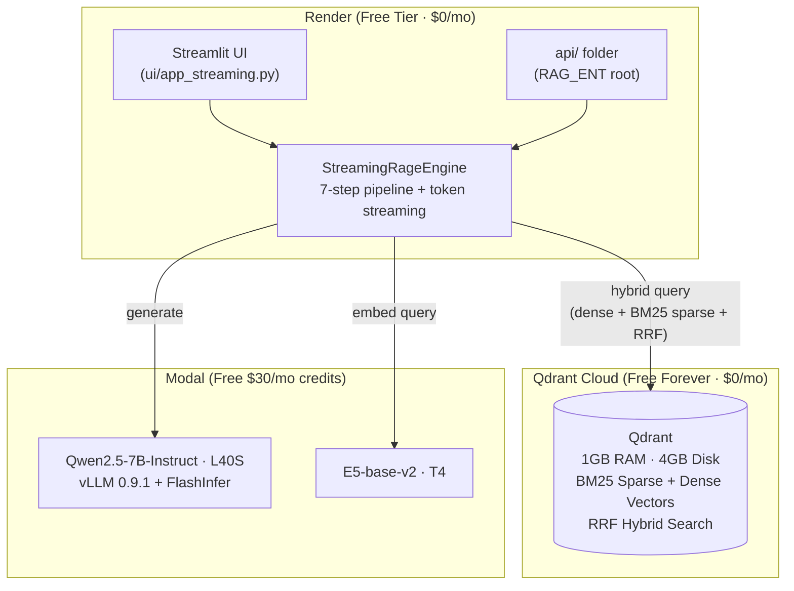

# RAGent Deployment Plan v4 — Zero-Cost Hosting (Final)

> **v4 changes**: LLM updated to Qwen2.5-7B-Instruct (streaming). All v3 changes retained: BM25 hybrid search, migration-first order, [api/](file:///d:/Sukesh/Anti-Gravity/RAG_ent/data/gamespot_data.py#121-137) folder, JSON cleanup.

---

## 1. Architecture Summary



### Cost: **$0/month total**

| Service | Cost |
|---------|------|
| Render (Streamlit) | $0 |
| Qdrant Cloud (Vector DB) | $0 (free forever: 1GB RAM, 4GB disk) |
| Modal (LLM + Embeddings) | $0 ($30/mo free credits) |
| External APIs | $0 (free tiers) |

---

## 2. Qdrant Hybrid Search Design

Weaviate used `alpha=0.5` hybrid (BM25 + vector). Qdrant achieves the **same** via native BM25 sparse vectors + dense vectors fused with **Reciprocal Rank Fusion (RRF)**.

### Collection Schema (EditorialChunk)

```python
from qdrant_client import QdrantClient, models

client.recreate_collection(
    collection_name="EditorialChunk",
    vectors_config={
        "dense": models.VectorParams(size=768, distance=models.Distance.COSINE),
    },
    sparse_vectors_config={
        "bm25": models.SparseVectorParams(
            modifier=models.Modifier.IDF,  # server-side IDF scoring
        ),
    },
)
```

### Hybrid Query (replaces Weaviate's `alpha=0.5`)

```python
from qdrant_client import models
from fastembed import SparseTextEmbedding

# BM25 sparse encoder (runs locally, lightweight)
bm25_encoder = SparseTextEmbedding(model_name="Qdrant/bm25")

# At query time:
sparse_emb = list(bm25_encoder.query_embed(query))[0]
dense_emb = embedder.embed_texts.remote([query])[0]  # Modal E5

results = client.query_points(
    collection_name="EditorialChunk",
    prefetch=[
        models.Prefetch(
            query=models.SparseVector(
                indices=sparse_emb.indices.tolist(),
                values=sparse_emb.values.tolist(),
            ),
            using="bm25",
            limit=20,
        ),
        models.Prefetch(
            query=dense_emb,
            using="dense",
            limit=20,
        ),
    ],
    query=models.FusionQuery(fusion=models.Fusion.RRF),
    limit=limit,
    with_payload=["content", "source_title", "chunk_index"],
)
```

### Ingestion (upsert with both vectors)

```python
from qdrant_client.models import PointStruct
from fastembed import SparseTextEmbedding

bm25_encoder = SparseTextEmbedding(model_name="Qdrant/bm25")

# For each editorial chunk:
sparse_emb = list(bm25_encoder.passage_embed([content]))[0]

client.upsert(
    collection_name="EditorialChunk",
    points=[PointStruct(
        id=chunk_uuid,
        vector={
            "dense": dense_vector,     # from Modal E5
            "bm25": models.SparseVector(
                indices=sparse_emb.indices.tolist(),
                values=sparse_emb.values.tolist(),
            ),
        },
        payload={
            "content": content,
            "source_title": title,
            "chunk_index": idx,
            "game_uuid": game_uuid,
            "parent_editorial_uuid": gamespot_uuid,
            "source": "gamespot",
            "content_type": content_type,
        },
    )],
)
```

---

## 3. Execution Order

> [!IMPORTANT]
> **Migration first, infrastructure files last.** Creating `requirements.txt` and `render.yaml` before the code migration would make them instantly outdated.

### Phase 1: Code Migration (22 changes)

#### Step 1: Connection + UUID Layer (8 files)

| # | File | Change |
|---|------|--------|
| 1 | [retriever/rag_retriever.py](file:///d:/Sukesh/Anti-Gravity/RAG_ent/retriever/rag_retriever.py) | [weaviate](file:///d:/Sukesh/Anti-Gravity/RAG_ent/upsert/upsert_canonical_game.py#72-84) → `QdrantClient` + BM25 hybrid query with RRF |
| 2 | [upsert/upsert_all.py](file:///d:/Sukesh/Anti-Gravity/RAG_ent/upsert/upsert_all.py) | `weaviate.connect_to_local()` → `QdrantClient` + remove JSON file I/O |
| 3 | [upsert/upsert_editorial_chunks.py](file:///d:/Sukesh/Anti-Gravity/RAG_ent/upsert/upsert_editorial_chunks.py) | Accept `List[Dict]` instead of `file_path` + Qdrant upsert with dual vectors |
| 4 | [upsert/upsert_canonical_game.py](file:///d:/Sukesh/Anti-Gravity/RAG_ent/upsert/upsert_canonical_game.py) | `WeaviateClient` → `QdrantClient` + Qdrant point upsert |
| 5 | [upsert/upsert_platform_specs.py](file:///d:/Sukesh/Anti-Gravity/RAG_ent/upsert/upsert_platform_specs.py) | Same as above |
| 6 | [upsert/upsert_igdb_metadata.py](file:///d:/Sukesh/Anti-Gravity/RAG_ent/upsert/upsert_igdb_metadata.py) | Same as above |
| 7 | [upsert/upsert_gamespot_chunks.py](file:///d:/Sukesh/Anti-Gravity/RAG_ent/upsert/upsert_gamespot_chunks.py) | Same as above |
| 8 | [vector/create_schema.py](file:///d:/Sukesh/Anti-Gravity/RAG_ent/vector/create_schema.py) | Rewrite for Qdrant collection creation with dense+sparse config |

#### Step 2: Ingest Layer — UUID + Beacon Removal (5 files)

| # | File | Change |
|---|------|--------|
| 9 | [ingest/ingest_gamespot.py](file:///d:/Sukesh/Anti-Gravity/RAG_ent/ingest/ingest_gamespot.py) | `weaviate.util.generate_uuid5` → stdlib `uuid5`. Beacon → `game_uuid` payload |
| 10 | [ingest/igdb_metadata_ingest.py](file:///d:/Sukesh/Anti-Gravity/RAG_ent/ingest/igdb_metadata_ingest.py) | Same |
| 11 | [ingest/gamespot_editorial_normalize.py](file:///d:/Sukesh/Anti-Gravity/RAG_ent/ingest/gamespot_editorial_normalize.py) | Same |
| 12 | [ingest/platformspec_ingest.py](file:///d:/Sukesh/Anti-Gravity/RAG_ent/ingest/platformspec_ingest.py) | Same |
| 13 | [embed/prepare_editorial_payloads.py](file:///d:/Sukesh/Anti-Gravity/RAG_ent/embed/prepare_editorial_payloads.py) | Remove beacon refs → `game_uuid` and `parent_editorial_uuid` payload fields |

#### Step 3: Data Fetcher I/O Elimination (3 files)

| # | File | Change |
|---|------|--------|
| 14 | [data/gamespot_data.py](file:///d:/Sukesh/Anti-Gravity/RAG_ent/data/gamespot_data.py) | Default `save=False` or callers pass `save=False` |
| 15 | [data/rawg_data.py](file:///d:/Sukesh/Anti-Gravity/RAG_ent/data/rawg_data.py) | Same — add `save` param, default `False` |
| 16 | [data/igdb_data.py](file:///d:/Sukesh/Anti-Gravity/RAG_ent/data/igdb_data.py) | Same |

#### Step 4: LLM Layer Alignment

> [!NOTE]
> The LLM layer has been upgraded. The new streaming pipeline is the **primary path**.

| # | File | Status | Notes |
|---|------|--------|-------|
| — | [llm/modal_llm.py](file:///d:/Sukesh/Anti-Gravity/RAG_ent/llm/modal_llm.py) | ✅ Already updated | Qwen2.5-7B-Instruct, vLLM 0.9.1, FlashInfer, [Qwen25VLLM](file:///d:/Sukesh/Anti-Gravity/RAG_ent/llm/modal_llm.py#96-301) class |
| — | [llm/ragent_client_streaming.py](file:///d:/Sukesh/Anti-Gravity/RAG_ent/llm/ragent_client_streaming.py) | ✅ Already updated | Streaming + blocking APIs targeting `qwen2-5-7b-instruct-vllm` |
| — | [engine/execution_engine_streaming.py](file:///d:/Sukesh/Anti-Gravity/RAG_ent/engine/execution_engine_streaming.py) | ✅ Already updated | [StreamingRageEngine](file:///d:/Sukesh/Anti-Gravity/RAG_ent/engine/execution_engine_streaming.py#86-408) with stage callbacks |
| — | [ui/app_streaming.py](file:///d:/Sukesh/Anti-Gravity/RAG_ent/ui/app_streaming.py) | ✅ Already updated | Primary Streamlit entry point with live token streaming |
| — | [ui/state_streaming.py](file:///d:/Sukesh/Anti-Gravity/RAG_ent/ui/state_streaming.py) | ✅ Already updated | Chat state management for streaming UI |
| 17 | [llm/ragent_client.py](file:///d:/Sukesh/Anti-Gravity/RAG_ent/llm/ragent_client.py) | ⚠️ **Stale** | Still references old `rag-smollm3-3b` app — update to `qwen2-5-7b-instruct-vllm` + [Qwen25VLLM](file:///d:/Sukesh/Anti-Gravity/RAG_ent/llm/modal_llm.py#96-301) for consistency |

**Key LLM changes already in codebase:**
- Model: ~~Mistral-7B~~ → **Qwen/Qwen2.5-7B-Instruct**
- Modal app: ~~`rag-smollm3-3b`~~ → `qwen2-5-7b-instruct-vllm`
- Class: ~~`MistralVLLM`~~ → [Qwen25VLLM](file:///d:/Sukesh/Anti-Gravity/RAG_ent/llm/modal_llm.py#96-301)
- Engine: ~~`modal.Function.from_name`~~ → `modal.Cls.from_name` + `.remote_gen()` streaming
- vLLM: upgraded to **0.9.1** with FlashInfer attention backend
- FAST_BOOT mode: skip CUDA-graph capture for ~20s cold starts (vs ~90s)

#### Step 5: New Files

| # | File | Change |
|---|------|--------|
| 18 | `api/__init__.py` | **[NEW]** Create [api/](file:///d:/Sukesh/Anti-Gravity/RAG_ent/data/gamespot_data.py#121-137) folder at RAG_ENT root |
| 19 | `api/routes.py` | **[NEW]** API routing endpoint (placeholder or FastAPI stub) |

#### Step 6: Cleanup

| # | Action |
|---|--------|
| 20 | **Delete** [far_cry_5_gamespot_full_textual.json](file:///d:/Sukesh/Anti-Gravity/RAG_ent/far_cry_5_gamespot_full_textual.json) from project root |
| 21 | **Delete** `assassin's_creed_valhalla_gamespot_full_textual.json` from project root |
| 22 | **Delete** any `data/*_editorial_chunks.json` intermediary files |
| 23 | **Update** [.gitignore](file:///d:/Sukesh/Anti-Gravity/RAG_ent/.gitignore) to permanently exclude `*_gamespot_full_textual.json` and `*_editorial_chunks.json` |

### Phase 2: Infrastructure Files (after migration verified locally)

| # | File | Description |
|---|------|-------------|
| 23 | `requirements.txt` | Lock deps: `qdrant-client`, `fastembed`, no `weaviate-client` |
| 24 | `Dockerfile` | Streamlit Docker image for Render |
| 25 | `render.yaml` | Render IaC with `QDRANT_URL`, `QDRANT_API_KEY` env vars |
| 26 | `.dockerignore` | Exclude venv, cache, JSON artifacts, [.env](file:///d:/Sukesh/Anti-Gravity/RAG_ent/.env) |

### Phase 3: Deploy to Render + Qdrant Cloud

1. Create Qdrant Cloud free cluster → note URL + API key
2. Run schema creation script locally → verify collections exist
3. Run ingestion pipeline locally → verify data in Qdrant dashboard
4. Push to GitHub → Render auto-builds Docker image
5. Configure env vars on Render dashboard
6. Verify Streamlit UI + hybrid search end-to-end

---

## 4. Detailed File Changes

### 4.1 [retriever/rag_retriever.py](file:///d:/Sukesh/Anti-Gravity/RAG_ent/retriever/rag_retriever.py) — Hybrid Search (Critical Path)

```diff
-import weaviate
+import os
+from qdrant_client import QdrantClient, models
+from fastembed import SparseTextEmbedding

-E5Embedder = modal.Cls.from_name(...)
+E5Embedder = modal.Cls.from_name("editorial-embedding-service", "E5Embedder")
+bm25_encoder = SparseTextEmbedding(model_name="Qdrant/bm25")

 class RAGRetriever:
     def __init__(self):
-        self.client = weaviate.connect_to_local()
+        url = os.environ.get("QDRANT_URL", "http://localhost:6333")
+        api_key = os.environ.get("QDRANT_API_KEY", "")
+        self.client = QdrantClient(url=url, api_key=api_key or None)
         self.embedder = E5Embedder()

     def retrieve(self, query, limit=5):
-        vector = self.embedder.embed_texts.remote([query])[0]
-        collection = self.client.collections.get("EditorialChunk")
-        response = collection.query.hybrid(
-            query=query, vector=vector, alpha=0.5, limit=limit, ...
-        )
+        dense_vec = self.embedder.embed_texts.remote([query])[0]
+        sparse_emb = list(bm25_encoder.query_embed(query))[0]
+
+        response = self.client.query_points(
+            collection_name="EditorialChunk",
+            prefetch=[
+                models.Prefetch(
+                    query=models.SparseVector(
+                        indices=sparse_emb.indices.tolist(),
+                        values=sparse_emb.values.tolist(),
+                    ),
+                    using="bm25", limit=20,
+                ),
+                models.Prefetch(query=dense_vec, using="dense", limit=20),
+            ],
+            query=models.FusionQuery(fusion=models.Fusion.RRF),
+            limit=limit,
+            with_payload=["content", "source_title", "chunk_index"],
+        )
```

### 4.2 [upsert/upsert_all.py](file:///d:/Sukesh/Anti-Gravity/RAG_ent/upsert/upsert_all.py) — JSON I/O Elimination

```diff
 # Stage 5 — BEFORE:
-safe = _safe_name(args.game)
-os.makedirs("data", exist_ok=True)
-file_path = os.path.join("data", f"{safe}_editorial_chunks.json")
-with open(file_path, "w", encoding="utf-8") as f:
-    json.dump(chunks, f, ensure_ascii=False, indent=2)
-upsert_chunk_batch(file_path)
+# Stage 5 — AFTER (in-memory):
+upsert_chunk_batch(chunks)  # pass list directly
```

### 4.3 [upsert/upsert_editorial_chunks.py](file:///d:/Sukesh/Anti-Gravity/RAG_ent/upsert/upsert_editorial_chunks.py) — In-Memory + Dual Vectors

```diff
-def upsert_chunk_batch(file_path: str, batch_size=64) -> None:
-    with open(file_path, "r", encoding="utf-8") as f:
-        payloads = json.load(f)
+def upsert_chunk_batch(payloads: List[Dict], batch_size=64) -> None:
+    # payloads passed in-memory — no file I/O
```

### 4.4 UUID Generation (4 ingest files)

```diff
-from weaviate.util import generate_uuid5
+from uuid import UUID, uuid5
+_NS = UUID("12345678-1234-5678-1234-567812345678")
+def generate_uuid5(seed): return str(uuid5(_NS, str(seed)))
```

### 4.5 Beacon References → Payload Fields (5 files)

```diff
-"game": {"beacon": f"weaviate://localhost/Game/{uuid}"}
+"game_uuid": uuid
```

### 4.6 [data/gamespot_data.py](file:///d:/Sukesh/Anti-Gravity/RAG_ent/data/gamespot_data.py) — Default `save=False`

```diff
 def fetch_gamespot_data(
     query: str, *,
-    save: bool = True,
+    save: bool = False,
     ...
```

### 4.7 [vector/create_schema.py](file:///d:/Sukesh/Anti-Gravity/RAG_ent/vector/create_schema.py) — Qdrant Collections

```diff
-import weaviate
+from qdrant_client import QdrantClient, models

 def main():
-    client = weaviate.connect_to_local()
-    for filename in SCHEMA_FILES:
-        schema = load_schema(SCHEMA_DIR / filename)
-        create_schema_if_missing(client, schema)
+    client = QdrantClient(url=QDRANT_URL, api_key=QDRANT_API_KEY)
+
+    # EditorialChunk: dense (E5-768) + sparse (BM25 IDF)
+    client.recreate_collection(
+        collection_name="EditorialChunk",
+        vectors_config={"dense": models.VectorParams(size=768, distance=models.Distance.COSINE)},
+        sparse_vectors_config={"bm25": models.SparseVectorParams(modifier=models.Modifier.IDF)},
+    )
+
+    # Metadata-only collections (payload-only, 1-dim dummy vector)
+    for name in ["Game", "PlatformSpec", "IGDB_Game", "GameSpot_Game"]:
+        client.recreate_collection(
+            collection_name=name,
+            vectors_config=models.VectorParams(size=1, distance=models.Distance.COSINE),
+        )
```

---

## 5. Updated Dependencies

### Added
| Package | Purpose |
|---------|---------|
| `qdrant-client>=1.17.0` | Qdrant Python SDK |
| `fastembed` | BM25 sparse vector generation (lightweight, CPU-only) |

### Removed
| Package | Reason |
|---------|--------|
| `weaviate-client` | Replaced by Qdrant |
| `langchain-weaviate` | Weaviate-specific integration |

### Environment Variables

| Old (Weaviate) | New (Qdrant) |
|----------------|-------------|
| `WEAVIATE_URL` | `QDRANT_URL` |
| `WEAVIATE_API_KEY` | `QDRANT_API_KEY` |

---

## Verification Plan

### Local Verification (before Render deploy)
1. `python vector/create_schema.py` — collections created in Qdrant
2. `python -m upsert.upsert_all --game "Far Cry 5"` — full pipeline, no JSON files written
3. Check Qdrant Cloud dashboard → points visible in EditorialChunk
4. `python -m streamlit run ui/app_streaming.py` → query returns hybrid search results with live token streaming

### Post-Deploy (Render)
1. Visit Render URL → Streamlit loads ([app_streaming.py](file:///d:/Sukesh/Anti-Gravity/RAG_ent/ui/app_streaming.py))
2. Submit query → 7-step pipeline runs with Qdrant hybrid search + Qwen2.5-7B streaming
3. Confirm no `*_gamespot_full_textual.json` files created
4. Verify cold start ≤ 60s (Render) + ~20s (Modal FAST_BOOT)
